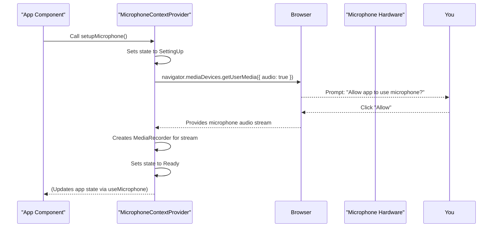

# Chapter 2: Microphone Control

In [Chapter 1: User Interface & Display Logic](01_user_interface___display_logic_.md), we explored how our app shows you what's happening – the live captions and the cool visualizer. But for the app to display your words and react to your voice, it first needs to **hear** you! This is where "Microphone Control" comes in.

Imagine our app has ears. This chapter is all about how we give those ears to the app, allowing it to listen to your voice, start and stop recording, and get the sound ready for further processing.

## What is Microphone Control?

Microphone Control is like the app's way of managing your device's microphone. It's responsible for a few key things:

1.  **Asking for Permission**: Before anything else, the app needs your permission to use the microphone.
2.  **Starting and Stopping**: It manages when the microphone actively records your voice and when it pauses or stops.
3.  **Getting Audio Data**: Once recording, it continuously grabs small chunks of your voice data, ready to be sent for transcription.

Think of it as the sound engineer of our application. It sets up the equipment, makes sure it's recording properly, and hands off the audio to other parts of the app.

## How Our App Uses Microphone Control

Our `nextjs-live-transcription` project uses a special tool called `MicrophoneContextProvider` to handle all these microphone tasks. It's like a central control panel for the microphone.

The main `App` component then uses this control panel to:
*   **Set up** the microphone when the app starts.
*   **Start** recording your voice when everything else is ready.
*   **Provide** the raw audio stream to the [Visualizer](01_user_interface___display_logic_.md) component so it can draw those cool sound waves.

Let's look at how the `App` component tells the microphone to get ready and start listening.

### Using the `useMicrophone` Hook

The `MicrophoneContextProvider` makes a special `useMicrophone` "hook" available. Hooks are a React feature that let you "hook into" React features from your functional components. This hook gives our `App` component access to all the microphone controls.

```tsx
// app/components/App.tsx (simplified)
import { useEffect } from "react";
import { useMicrophone } from "../context/MicrophoneContextProvider"; // Our microphone hook!

const App: () => JSX.Element = () => {
  const { setupMicrophone, microphone, startMicrophone, microphoneState } =
    useMicrophone(); // Get microphone tools

  useEffect(() => {
    // When the app first loads, tell the microphone to set itself up.
    setupMicrophone();
  }, []); // [] means this runs only once when the component appears

  useEffect(() => {
    // If the microphone is ready AND our connection to Deepgram is open (covered later),
    // then it's time to start recording!
    if (microphoneState === MicrophoneState.Ready /* && connection is open */) {
      startMicrophone();
    }
  }, [microphoneState]); // This runs whenever microphoneState changes

  // ... rest of the App component returns the user interface
};

export default App;
```

*   **`useMicrophone()`**: This line is where our `App` component "hooks into" the microphone's features. It gives us functions like `setupMicrophone` and `startMicrophone`, and information like `microphoneState`.
*   **`setupMicrophone()`**: Called right when the `App` component loads, this function asks your browser for permission to use the microphone and gets the microphone hardware ready.
*   **`startMicrophone()`**: Once the microphone is set up and our transcription service is ready (we'll learn about [Deepgram Live Transcription Service](03_deepgram_live_transcription_service_.md) in the next chapter!), this function tells the microphone to start actively recording your voice.

### Connecting to the Visualizer

Remember the [Visualizer component](01_user_interface___display_logic_.md) from the last chapter? It needs the actual audio stream to draw those pretty waves. Our `App` component passes the `microphone` object to it:

```tsx
// app/components/App.tsx (simplified)
// ...
import Visualizer from "./Visualizer";

const App: () => JSX.Element = () => {
  const { microphone } = useMicrophone(); // Get the microphone object

  return (
    <>
      <div className="relative w-full h-full">
        {/* If the microphone object exists, pass it to the Visualizer */}
        {microphone && <Visualizer microphone={microphone} />}

        {/* ... rest of the UI ... */}
      </div>
    </>
  );
};
// ...
```

*   **`{microphone && <Visualizer microphone={microphone} />}`**: This line says: "If we have a microphone object, then display the `Visualizer` and give it access to that `microphone`." The `Visualizer` then uses this object to tap into the live audio stream.

## Under the Hood: How Microphone Control Works

Let's peek behind the curtain to see how `MicrophoneContextProvider` makes all this happen. It uses a few browser technologies to interact with your device's microphone.

### Step-by-Step Microphone Setup

When `setupMicrophone()` is called, here's what happens:



1.  **Request Access**: `MicrophoneContextProvider` uses `navigator.mediaDevices.getUserMedia({ audio: true })` to ask your browser for access to the microphone. This is when you usually see a pop-up asking for permission.
2.  **Get Stream**: If you grant permission, the browser provides a `MediaStream` object, which is like a pipe carrying your live audio.
3.  **Create Recorder**: `MicrophoneContextProvider` then takes this `MediaStream` and creates a `MediaRecorder` object. This `MediaRecorder` is the actual tool that will capture your audio data.
4.  **Ready State**: The `MicrophoneContextProvider` updates its internal state to `Ready`, letting the rest of the app know it's good to go.

### Key Browser Tools

`MicrophoneContextProvider` relies on two main browser features:

| Tool                 | What it Does                                                                                              | Analogy                                       |
| :------------------- | :-------------------------------------------------------------------------------------------------------- | :-------------------------------------------- |
| `navigator.mediaDevices.getUserMedia()` | Asks the user for permission to access their microphone (or camera) and, if granted, provides a live audio stream. | The "permission slip" and "audio cable"      |
| `MediaRecorder`      | Takes an audio stream and records it, letting us get chunks of audio data as `Blob`s.                     | The "tape recorder" that records your voice |

### The Code Behind the Control

Let's look at the core functions inside `app/context/MicrophoneContextProvider.tsx`.

#### 1. Setting Up the Microphone

```tsx
// app/context/MicrophoneContextProvider.tsx (simplified)
import { useState } from "react";

export enum MicrophoneState {
  NotSetup = -1,
  SettingUp = 0,
  Ready = 1,
  // ... other states
}

const MicrophoneContextProvider: React.FC<any> = ({ children }) => {
  const [microphoneState, setMicrophoneState] = useState<MicrophoneState>(
    MicrophoneState.NotSetup
  );
  const [microphone, setMicrophone] = useState<MediaRecorder | null>(null);

  const setupMicrophone = async () => {
    setMicrophoneState(MicrophoneState.SettingUp); // Start setup

    try {
      // Ask browser for audio access
      const userMedia = await navigator.mediaDevices.getUserMedia({ audio: true });

      // Create a recorder for the audio stream
      const microphone = new MediaRecorder(userMedia);

      setMicrophoneState(MicrophoneState.Ready); // Now it's ready!
      setMicrophone(microphone); // Store the recorder object
    } catch (err: any) {
      console.error("Error setting up microphone:", err);
      // Handle error (e.g., user denied permission)
      setMicrophoneState(MicrophoneState.Error);
    }
  };

  // ... rest of the context provider
};
```

*   **`MicrophoneState`**: This `enum` (a set of named constants) helps us track what the microphone is currently doing. Is it setting up? Is it ready? Is there an error?
*   **`useState<MediaRecorder | null>(null)`**: This stores the `MediaRecorder` object once it's created. This `microphone` object is what gets passed to the `Visualizer`.
*   **`navigator.mediaDevices.getUserMedia({ audio: true })`**: This is the crucial line that requests access to your microphone.
*   **`new MediaRecorder(userMedia)`**: If permission is granted, `userMedia` contains the live audio stream, and we create a `MediaRecorder` to handle it.

#### 2. Starting the Recording

```tsx
// app/context/MicrophoneContextProvider.tsx (simplified)
// ... (inside MicrophoneContextProvider)

const startMicrophone = () => {
  setMicrophoneState(MicrophoneState.Opening); // Indicate we're starting

  if (microphone?.state === "paused") {
    microphone.resume(); // If paused, just resume
  } else {
    // Start recording, taking chunks of audio every 250 milliseconds
    microphone?.start(250);
  }

  setMicrophoneState(MicrophoneState.Open); // Now it's actively recording!
};

// ...
```

*   **`microphone?.start(250)`**: This line tells the `MediaRecorder` to begin recording. The `250` means it will gather audio data for 250 milliseconds, then create a `BlobEvent` with that data. This `BlobEvent` is then sent to our transcription service.
*   **`microphone.resume()`**: If the microphone was previously paused, this simply restarts it without setting up a new recording.

## Conclusion

In this chapter, we learned how our `nextjs-live-transcription` app gains its "ears" through "Microphone Control." We saw how the `MicrophoneContextProvider` handles setting up the microphone, asking for permissions, and managing the recording process using browser features like `getUserMedia` and `MediaRecorder`. The `App` component then uses the `useMicrophone` hook to interact with this system, and passes the live audio stream to the [Visualizer](01_user_interface___display_logic_.md) for real-time feedback.

Now that our app can hear you, the next step is to understand how it turns those sounds into text. In the next chapter, we'll dive into the [Deepgram Live Transcription Service](03_deepgram_live_transcription_service_.md).

---

<sub><sup>Generated by [AI Codebase Knowledge Builder](https://github.com/The-Pocket/Tutorial-Codebase-Knowledge).</sup></sub> <sub><sup>**References**: [[1]](https://github.com/deepgram-starters/nextjs-live-transcription/blob/fa63f1a0a9f39fc9ef1dea993214479dfb5bf244/app/components/App.tsx), [[2]](https://github.com/deepgram-starters/nextjs-live-transcription/blob/fa63f1a0a9f39fc9ef1dea993214479dfb5bf244/app/components/Visualizer.tsx), [[3]](https://github.com/deepgram-starters/nextjs-live-transcription/blob/fa63f1a0a9f39fc9ef1dea993214479dfb5bf244/app/context/MicrophoneContextProvider.tsx)</sup></sub>