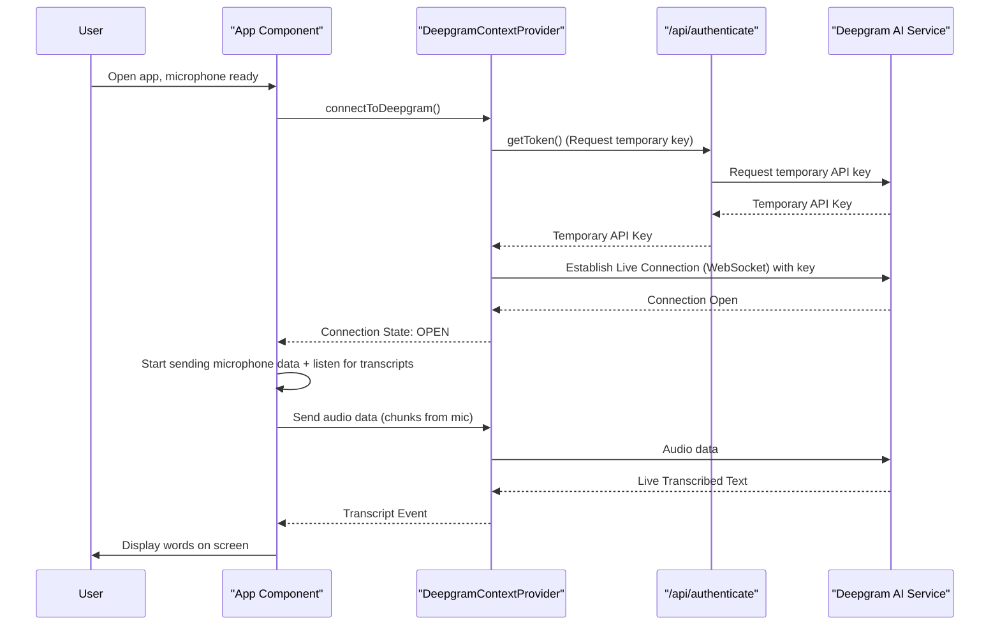

# Chapter 3: Deepgram Live Transcription Service

In [Chapter 1: User Interface & Display Logic](01_user_interface___display_logic_.md), we learned how our app displays your spoken words and a cool visualizer. Then, in [Chapter 2: Microphone Control](02_microphone_control_.md), we discovered how the app listens to your voice. Now, with the app seeing and hearing, it's time for the most exciting part: **understanding** what you're saying!

This is where the "Deepgram Live Transcription Service" comes in. Imagine you're speaking, and almost instantly, your words appear as text on the screen. This chapter will show you how our app achieves this magic by connecting to Deepgram, a powerful AI service that converts speech into text in real-time.

## What is the Deepgram Live Transcription Service?

Think of this part of our app as a super-fast, intelligent **interpreter**. Its job is to:

1.  **Listen Carefully**: It receives your voice data from the [Microphone Control](02_microphone_control_.md) part.
2.  **Talk to an Expert**: It sends your voice instantly to Deepgram's powerful Artificial Intelligence (AI) in the cloud.
3.  **Get the Translation**: Deepgram's AI processes your voice and sends back the transcribed text (your words!).
4.  **Share the Message**: It delivers these words back to the app's display, so you can see them.

All this happens in **real-time**, meaning there's very little delay between you speaking and the text appearing on your screen. It's like having a lightning-fast translator right inside your app!

The `DeepgramContextProvider` is the central orchestrator for all this. It handles the connection to Deepgram, sends your audio, and manages the incoming text.

## How Our App Uses Deepgram

Our `App` component needs to "talk" to the Deepgram service. It does this using a special tool called `useDeepgram` from the `DeepgramContextProvider`. This hook gives `App` everything it needs to connect, send audio, and receive transcripts.

Let's see how the `App` component (`app/components/App.tsx`) tells Deepgram to get ready and start transcribing.

### 1. Connecting to Deepgram

First, after the microphone is ready (as we saw in [Chapter 2](02_microphone_control_.md)), the `App` component tells the `DeepgramContextProvider` to establish a connection.

```tsx
// app/components/App.tsx (simplified)
import { useDeepgram } from "../context/DeepgramContextProvider";
import { MicrophoneState, useMicrophone } from "../context/MicrophoneContextProvider";
import { useEffect } from "react";

const App: () => JSX.Element = () => {
  const { connection, connectToDeepgram, connectionState } = useDeepgram();
  const { microphoneState, startMicrophone } = useMicrophone();

  useEffect(() => {
    // When microphone is ready, connect to Deepgram
    if (microphoneState === MicrophoneState.Ready) {
      connectToDeepgram({
        model: "nova-3",         // Use the advanced Nova-3 model
        interim_results: true,   // Show results as you speak, not just final ones
        smart_format: true,      // Make text look nicer (e.g., numbers, punctuation)
        utterance_end_ms: 3000,  // How long before Deepgram thinks you've paused speaking
      });
    }
  }, [microphoneState]); // This runs when microphoneState changes

  // ... rest of the App component
};
```

*   **`useDeepgram()`**: This line is how our `App` component gets access to Deepgram's tools, like `connectToDeepgram` and information about the `connectionState`.
*   **`connectToDeepgram(...)`**: This function tells the Deepgram service to start a connection. We pass it some `options` to tell Deepgram how we want our speech transcribed:
    *   `model: "nova-3"`: This is like choosing a specific, high-quality translator for your speech.
    *   `interim_results: true`: Deepgram will send you words *as you speak them*, even before you finish a sentence. This makes the captions appear instantly.
    *   `smart_format: true`: Deepgram tries to make the text easier to read, like adding punctuation and converting numbers.

### 2. Sending Audio and Receiving Transcriptions

Once the connection to Deepgram is `OPEN`, our `App` component does two important things:

*   It starts sending your microphone's audio data to Deepgram.
*   It sets up a listener to receive the transcribed text back from Deepgram.

```tsx
// app/components/App.tsx (simplified)
import {
  LiveConnectionState,
  LiveTranscriptionEvents,
  type LiveTranscriptionEvent,
  useDeepgram,
} from "../context/DeepgramContextProvider";
import { MicrophoneEvents, MicrophoneState, useMicrophone } from "../context/MicrophoneContextProvider";
import { useEffect, useRef, useState } from "react";

const App: () => JSX.Element = () => {
  const [caption, setCaption] = useState<string | undefined>("Powered by Deepgram");
  const { connection, connectionState } = useDeepgram();
  const { microphone, startMicrophone } = useMicrophone();
  const captionTimeout = useRef<any>();

  useEffect(() => {
    if (!microphone || !connection) return; // Make sure we have both

    // This function sends microphone audio data to Deepgram
    const onData = (e: BlobEvent) => {
      if (e.data.size > 0) { // Only send data if there's actual sound
        connection?.send(e.data);
      }
    };

    // This function receives transcribed text from Deepgram
    const onTranscript = (data: LiveTranscriptionEvent) => {
      let thisCaption = data.channel.alternatives[0].transcript;
      if (thisCaption !== "") {
        setCaption(thisCaption); // Update the displayed caption
      }

      // If Deepgram thinks speech has finished, clear the caption after a delay
      if (data.is_final && data.speech_final) {
        clearTimeout(captionTimeout.current);
        captionTimeout.current = setTimeout(() => {
          setCaption(undefined);
        }, 3000); // Caption disappears after 3 seconds
      }
    };

    if (connectionState === LiveConnectionState.OPEN) {
      // Start listening for transcript events from Deepgram
      connection.addListener(LiveTranscriptionEvents.Transcript, onTranscript);
      // Start listening for audio data from the microphone
      microphone.addEventListener(MicrophoneEvents.DataAvailable, onData);

      startMicrophone(); // Tell the microphone to start sending data
    }

    return () => { // Cleanup when component is removed or effect re-runs
      connection.removeListener(LiveTranscriptionEvents.Transcript, onTranscript);
      microphone.removeEventListener(MicrophoneEvents.DataAvailable, onData);
      clearTimeout(captionTimeout.current);
    };
  }, [connectionState, microphone, connection, startMicrophone]); // Re-run if these change

  // ... rest of the App component returns UI
  return (
    <>
      <div className="absolute bottom-[8rem] inset-x-0 max-w-4xl mx-auto text-center">
        {caption && <span className="bg-black/70 p-8">{caption}</span>}
      </div>
    </>
  );
};
```

*   **`microphone.addEventListener(MicrophoneEvents.DataAvailable, onData)`**: This line hooks up our `onData` function to the microphone. Every time the microphone captures a chunk of audio (as a `BlobEvent`), `onData` is called.
*   **`connection?.send(e.data)`**: Inside `onData`, this is the crucial line that takes the microphone's audio chunk (`e.data`) and sends it directly to Deepgram through our live connection.
*   **`connection.addListener(LiveTranscriptionEvents.Transcript, onTranscript)`**: This line tells our app: "Hey Deepgram, whenever you have some transcribed text ready, please call my `onTranscript` function!"
*   **`setCaption(thisCaption)`**: Inside `onTranscript`, we receive the actual words. We then use `setCaption` (from [Chapter 1](01_user_interface___display_logic_.md)) to update the text displayed on the screen.

## Under the Hood: How Deepgram Does the Magic

Let's peek behind the curtain to see how `DeepgramContextProvider` makes this happen.

### Step-by-Step Connection and Transcription

When the `App` component calls `connectToDeepgram()`, here's a simplified view of the communication:



1.  **Get an API Key**: Before connecting to Deepgram, our `DeepgramContextProvider` needs a special, temporary "access pass" (an API key). It gets this by making a request to our own server's `/api/authenticate` endpoint. This endpoint securely asks Deepgram for a temporary key.
2.  **Create a Live Connection**: Once we have the temporary key, `DeepgramContextProvider` uses it to create a `LiveClient`. This `LiveClient` then opens a **WebSocket** connection directly to the Deepgram AI service.
3.  **Real-Time Communication**: A WebSocket is like a persistent, open phone line between our app and Deepgram. Unlike traditional web requests (HTTP), which are like sending a letter back and forth, a WebSocket allows continuous, two-way communication. This is perfect for live transcription!
4.  **Send & Receive**: Your microphone's audio chunks are continuously sent through this open WebSocket to Deepgram. Deepgram processes them and sends back the transcribed text, also through the same WebSocket, almost instantly.

### Key Tools for Live Communication

The `DeepgramContextProvider` relies on a few key concepts:

| Tool/Concept        | What it Does                                                                                                    | Analogy                                                        |
| :------------------ | :-------------------------------------------------------------------------------------------------------------- | :------------------------------------------------------------- |
| `WebSocket`         | A web technology that allows a continuous, two-way communication channel between your browser and a server.     | An open phone line for constant conversation.                  |
| `LiveClient`        | A special object from the Deepgram SDK that manages the WebSocket connection and sends/receives data.           | The "phone" itself, handling the calls to Deepgram.            |
| `LiveTranscriptionEvents` | Special messages (like `Open`, `Close`, `Transcript`) that Deepgram sends to tell us what's happening.    | Notifications from the "phone" (e.g., "call connected," "new message"). |

### The Code Behind the Connection (`app/context/DeepgramContextProvider.tsx`)

Let's look at the core functions inside `DeepgramContextProvider.tsx`.

#### 1. Getting the Temporary API Key

The `getToken` function is responsible for fetching that temporary access pass from our server.

```tsx
// app/context/DeepgramContextProvider.tsx (simplified)
const getToken = async (): Promise<string> => {
  const response = await fetch("/api/authenticate", { cache: "no-store" });
  const result = await response.json();
  return result.access_token; // This is our temporary key!
};
```

*   **`fetch("/api/authenticate")`**: This line makes a request to a special part of our own Next.js application. Our server-side code (in `app/api/authenticate/route.ts`) then securely talks to Deepgram to get a temporary key. This is a common pattern to keep sensitive API keys safe on the server and not exposed in your user's browser.
*   **`result.access_token`**: This is the actual temporary key that Deepgram gives us to use for our live connection.

#### 2. Connecting to Deepgram and Setting Up Listeners

The `connectToDeepgram` function uses this token to establish the live connection.

```tsx
// app/context/DeepgramContextProvider.tsx (simplified)
import { createClient, LiveClient, LiveConnectionState, LiveTranscriptionEvents } from "@deepgram/sdk";
import { createContext, useContext, useState, ReactNode, FunctionComponent } from "react";

// ... other context setup

const DeepgramContextProvider: FunctionComponent<any> = ({ children }) => {
  const [connection, setConnection] = useState<LiveClient | null>(null);
  const [connectionState, setConnectionState] = useState<LiveConnectionState>(
    LiveConnectionState.CLOSED
  );

  const connectToDeepgram = async (options: any, endpoint?: string) => {
    const token = await getToken(); // Get the temporary key
    const deepgram = createClient({ accessToken: token }); // Initialize Deepgram with the key

    // Create the live client, which opens the WebSocket connection
    const conn = deepgram.listen.live(options, endpoint);

    // Add listeners for important events from Deepgram
    conn.addListener(LiveTranscriptionEvents.Open, () => {
      setConnectionState(LiveConnectionState.OPEN); // Update state when connection is open
    });
    conn.addListener(LiveTranscriptionEvents.Close, () => {
      setConnectionState(LiveConnectionState.CLOSED); // Update state when connection closes
    });

    setConnection(conn); // Store the live client object
  };

  // ... rest of the context provider
};
```

*   **`const token = await getToken();`**: First, we get our temporary access key.
*   **`const deepgram = createClient({ accessToken: token });`**: We use the Deepgram SDK (Software Development Kit) to create a client, providing our temporary access key.
*   **`const conn = deepgram.listen.live(options, endpoint);`**: This is the magic line! It tells the Deepgram SDK to open a **live transcription connection** (a WebSocket) to the Deepgram AI. We pass in our transcription `options` (like `model`, `interim_results`).
*   **`conn.addListener(...)`**: We set up "event listeners" on this `conn` object. This means when Deepgram sends specific messages (like "connection is open" or "connection is closed"), our functions will be called to update our `connectionState`.

### The API Route (`app/api/authenticate/route.ts`)

For completeness, let's briefly look at the (simplified) server-side code that provides the temporary API key.

```typescript
// app/api/authenticate/route.ts (simplified)
import { createClient } from "@deepgram/sdk";
import { NextResponse, type NextRequest } from "next/server";

export async function GET(request: NextRequest) {
  // Our secret (permanent) API key is safely stored on the server
  const deepgram = createClient(process.env.DEEPGRAM_API_KEY ?? "");

  // Request a TEMPORARY, short-lived token from Deepgram
  let { result: tokenResult, error: tokenError } =
    await deepgram.auth.grantToken();

  if (tokenError) {
      return NextResponse.json(tokenError); // Handle errors
  }

  // Send the temporary token back to the browser
  const response = NextResponse.json({ ...tokenResult });
  // Set headers to prevent caching, so we always get a fresh token
  response.headers.set("Cache-Control", "no-store");
  return response;
}
```

*   **`createClient(process.env.DEEPGRAM_API_KEY ?? "")`**: Here, we use our *actual, permanent* Deepgram API key (stored securely on the server as an environment variable) to create a Deepgram client.
*   **`deepgram.auth.grantToken()`**: We use this client to ask Deepgram for a *temporary* token. This temporary token is what our browser-side `DeepgramContextProvider` uses. This is safer because if someone inspects our web page, they won't find our permanent, secret API key.
*   **`NextResponse.json({ ...tokenResult })`**: We send this temporary token back to our browser.

## Conclusion

In this chapter, we unlocked the core intelligence of our `nextjs-live-transcription` app: the "Deepgram Live Transcription Service." We learned how it acts as an interpreter, connecting our app to Deepgram's powerful AI. We saw how the `useDeepgram` hook in the `App` component establishes a live WebSocket connection, sends microphone audio, and receives transcribed text to display on the screen. We also peeked behind the curtain to understand how temporary API keys are managed and how the `DeepgramContextProvider` orchestrates this real-time communication.

Now that we know how the app gets its smarts, you might be wondering more about those API keys and how they're managed securely. In the next chapter, we'll explore the [API Key Provider](04_api_key_provider_.md).

---

<sub><sup>Generated by [AI Codebase Knowledge Builder](https://github.com/The-Pocket/Tutorial-Codebase-Knowledge).</sup></sub> <sub><sup>**References**: [[1]](https://github.com/deepgram-starters/nextjs-live-transcription/blob/fa63f1a0a9f39fc9ef1dea993214479dfb5bf244/app/api/authenticate/route.ts), [[2]](https://github.com/deepgram-starters/nextjs-live-transcription/blob/fa63f1a0a9f39fc9ef1dea993214479dfb5bf244/app/components/App.tsx), [[3]](https://github.com/deepgram-starters/nextjs-live-transcription/blob/fa63f1a0a9f39fc9ef1dea993214479dfb5bf244/app/context/DeepgramContextProvider.tsx)</sup></sub>