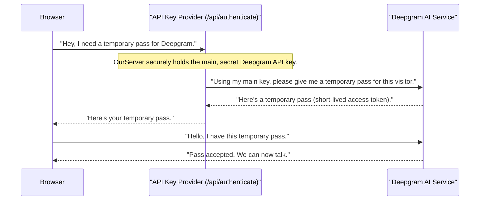

# Chapter 4: API Key Provider

In [Chapter 3: Deepgram Live Transcription Service](03_deepgram_live_transcription_service_.md), we saw how our app connects to Deepgram using a special "access pass" (an API key) to get real-time transcriptions. But what if this important access pass falls into the wrong hands? Imagine leaving your house keys under the doormat – it's easy for anyone to find and use them!

The "API Key Provider" is like a super-secure safe deposit box for our Deepgram API key. Instead of leaving our main, secret key lying around where anyone (especially in the user's browser) could find it, this system provides a safer way to get temporary "guest passes." This chapter will explain how we keep our sensitive Deepgram credentials safe while still allowing our app to function perfectly.

## The Problem: Keeping Secrets Safe

Every time our app connects to Deepgram, it needs authorization, like showing an ID. Deepgram uses API keys for this. We have a *main* Deepgram API key that grants full access to our Deepgram account. This key is very powerful and must be kept secret.

If we put this main key directly into the code that runs in your web browser, anyone inspecting the browser's code could find it. If they find it, they could potentially use our Deepgram account without permission, leading to unexpected charges or misuse. This is a big security risk!

## The Solution: The API Key Provider (Secure Gatekeeper)

Our "API Key Provider" solves this problem by acting as a secure gatekeeper. It has two main jobs:

1.  **Hold the Secret**: It securely stores our *main, long-lived* Deepgram API key on our server, far away from your browser.
2.  **Issue Temporary Passes**: When your browser needs to talk to Deepgram, it doesn't get the main key. Instead, it asks our "API Key Provider" (which is a special part of our server). The provider then securely asks Deepgram for a *temporary, short-lived* access token, and gives *that* temporary token to your browser.

Think of it this way:

*   **Main Deepgram API Key**: Your personal house key (very important, never give it out).
*   **API Key Provider (Our Server)**: A trusted doorman at your house.
*   **Temporary Access Token**: A visitor's pass given by the doorman, which works only for a short visit and can't unlock the whole house.
*   **Browser**: Your visitor who needs to get in for a short time.

This ensures that even if someone gets the temporary pass from your browser, they can't do much damage because it expires quickly and doesn't grant full access.

## How Our App Uses the API Key Provider

Our `DeepgramContextProvider` (from [Chapter 3](03_deepgram_live_transcription_service_.md)) is the component that talks to Deepgram. When it needs to establish a connection, it asks our "API Key Provider" for a temporary token.

Let's review the `getToken` function inside `DeepgramContextProvider.tsx` to see this in action:

```tsx
// app/context/DeepgramContextProvider.tsx (simplified)
const getToken = async (): Promise<string> => {
  // 1. Make a request to our own server's special route
  const response = await fetch("/api/authenticate", { cache: "no-store" });
  
  // 2. Get the response, which contains the temporary token
  const result = await response.json();
  
  // 3. Return the temporary token for Deepgram connection
  return result.access_token; 
};
```

*   **`fetch("/api/authenticate")`**: This is the key line! Instead of using a directly exposed API key, our browser makes a request to a special address (`/api/authenticate`) *on our own server*. This `/api/authenticate` is our "API Key Provider."
*   **`return result.access_token;`**: Our server responds with a `result` object, and inside it is the `access_token` – this is our temporary, short-lived guest pass from Deepgram.

Once `DeepgramContextProvider` has this temporary `access_token`, it uses it to connect to Deepgram, just like we saw in the previous chapter. The important difference is that the browser never saw the *main* secret key.

## Under the Hood: How the Secure Gatekeeper Works

Let's look at the secret "vault" on our server, which is the actual "API Key Provider." This is a special serverless function (an "API route" in Next.js) located at `app/api/authenticate/route.ts`.

### Step-by-Step Security

Here's how the secure exchange happens when your browser needs a temporary token:



1.  **Browser Requests**: Your browser (via `getToken()` in `DeepgramContextProvider`) sends a request to our `OurServer` at the `/api/authenticate` address.
2.  **Server's Secret**: `OurServer` has access to the highly confidential, *main* Deepgram API key, stored as an environment variable (`process.env.DEEPGRAM_API_KEY`). This key is never sent to the browser.
3.  **Server Asks Deepgram**: `OurServer` uses this main key to ask the Deepgram AI service for a *temporary* access token.
4.  **Deepgram Grants Token**: Deepgram generates a new, short-lived token and sends it back to `OurServer`.
5.  **Server Delivers Token**: `OurServer` then sends this temporary token back to your browser.
6.  **Browser Connects**: Your browser now has a valid, but temporary, token. It uses this token to directly establish a live connection with Deepgram, as we learned in [Chapter 3: Deepgram Live Transcription Service](03_deepgram_live_transcription_service_.md).

### The Code Behind the Secure Gatekeeper (`app/api/authenticate/route.ts`)

Let's look at the simplified code in `app/api/authenticate/route.ts` that powers our API Key Provider:

```typescript
// app/api/authenticate/route.ts
import { createClient } from "@deepgram/sdk";
import { NextResponse, type NextRequest } from "next/server";

export async function GET(request: NextRequest) {
  // Use our main, secret Deepgram API key (stored safely on the server)
  const deepgram = createClient(process.env.DEEPGRAM_API_KEY ?? "");

  // Ask Deepgram to grant a TEMPORARY, short-lived token
  let { result: tokenResult, error: tokenError } =
    await deepgram.auth.grantToken();

  if (tokenError) {
      // If something went wrong, return an error
      return NextResponse.json(tokenError); 
  }

  // Send the temporary token back to the browser
  const response = NextResponse.json({ ...tokenResult });
  // Set headers to prevent caching, always get a fresh token
  response.headers.set("Cache-Control", "no-store"); 
  return response;
}
```

*   **`createClient(process.env.DEEPGRAM_API_KEY ?? "")`**: This line is where our API route uses the `DEEPGRAM_API_KEY`. This key is stored as an **environment variable**, which means it's a secret value only available to the server code, never shipped to the browser.
*   **`deepgram.auth.grantToken()`**: This tells the Deepgram SDK (using our main, secret key) to create a *new, temporary* access token. Deepgram is designed to make these temporary tokens for situations exactly like this.
*   **`NextResponse.json({ ...tokenResult })`**: Finally, our server sends this `tokenResult` (which contains the temporary token) back to the browser.
*   **`response.headers.set("Cache-Control", "no-store");`**: This is important! It ensures that the browser *always* asks for a new temporary token and doesn't reuse an old, possibly expired one.

This entire mechanism ensures that our application's critical Deepgram credentials are never directly exposed to the client-side code, significantly enhancing the security of our application.

## Conclusion

In this chapter, we've explored the "API Key Provider" – our secure gatekeeper for accessing Deepgram. We learned why it's crucial to protect our main Deepgram API key and how this system provides temporary, short-lived access tokens via a serverless API route (`/api/authenticate`). This secure mechanism ensures that all communication with Deepgram is properly authorized without ever risking the security of our sensitive credentials in the browser.

Now that we understand how our app keeps its secrets safe, let's move on to how different parts of the app share information and work together smoothly. In the next chapter, we'll dive into [Global State Management (React Context)](05_global_state_management__react_context__.md).

---

<sub><sup>Generated by [AI Codebase Knowledge Builder](https://github.com/The-Pocket/Tutorial-Codebase-Knowledge).</sup></sub> <sub><sup>**References**: [[1]](https://github.com/deepgram-starters/nextjs-live-transcription/blob/fa63f1a0a9f39fc9ef1dea993214479dfb5bf244/app/api/authenticate/route.ts), [[2]](https://github.com/deepgram-starters/nextjs-live-transcription/blob/fa63f1a0a9f39fc9ef1dea993214479dfb5bf244/app/context/DeepgramContextProvider.tsx), [[3]](https://github.com/deepgram-starters/nextjs-live-transcription/blob/fa63f1a0a9f39fc9ef1dea993214479dfb5bf244/middleware.ts)</sup></sub>