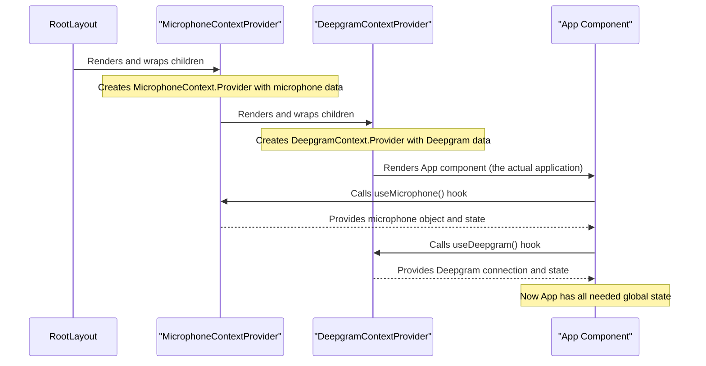

# Chapter 5: Global State Management (React Context)

In our journey so far, we've explored how our app displays information ([Chapter 1: User Interface & Display Logic](01_user_interface___display_logic_.md)), how it listens to your voice ([Chapter 2: Microphone Control](02_microphone_control_.md)), how it smartly transcribes your speech with Deepgram ([Chapter 3: Deepgram Live Transcription Service](03_deepgram_live_transcription_service_.md)), and how it keeps important secrets safe ([Chapter 4: API Key Provider](04_api_key_provider_.md)).

Now, imagine our application is a bustling office. Different departments (components) need to share important announcements (data) to work together effectively. Without a clear system, information might get passed around inefficiently, like a game of "telephone," or even get lost.

This is where "Global State Management" comes in. This chapter will introduce you to **React Context**, a powerful pattern that acts like a central broadcasting station, allowing different parts of our app to easily share important information without a lot of hassle.

## The Problem: "Prop Drilling"

Let's say our `App` component needs information about the microphone, and a component deep inside the `App` (let's call it `SomeChildComponent`) also needs that microphone information.

Without a global way to share, the `App` component would have to receive the microphone data and then pass it down to its child, which then passes it to its child, and so on, until it reaches `SomeChildComponent`. This is called "prop drilling," and it can get messy very quickly:

```mermaid
graph TD
    A[App Component] --> B[Child Component 1]: Pass microphone data
    B --> C[Child Component 2]: Pass microphone data
    C --> D[SomeChildComponent]: Finally gets microphone data!
```

It's like trying to tell a secret to someone at the end of a long line, but you have to whisper it to *everyone* in between, even if they don't care about the secret! This makes code harder to read, maintain, and reuse.

## The Solution: React Context (A Central Broadcast)

React Context solves prop drilling by providing a way to share data that can be considered "global" for a certain part of your app. Think of it as:

*   **A Public Radio Station**: This is the `Context` itself, a channel where information is broadcast.
*   **A Radio Tower**: This is the `Provider` component. It "broadcasts" specific data to anyone who tunes in below it.
*   **A Radio Receiver**: This is the `useContext` hook. Any component can "tune in" to the broadcast and instantly receive the data it needs, without waiting for someone to pass it directly.

```mermaid
graph TD
    A[App Component] --> B{MicrophoneContextProvider}: Broadcast microphone status
    B --> C{DeepgramContextProvider}: Broadcast Deepgram status
    C --> D[Visualizer Component]: Tune in for microphone status
    C --> E[App Component (inside providers)]: Tune in for both microphone & Deepgram status
```

In our `nextjs-live-transcription` project, this pattern is used to share critical data like:
*   The `microphone` object and its `microphoneState` (e.g., `Ready`, `Open`).
*   The `deepgram connection` object and its `connectionState` (e.g., `OPEN`, `CLOSED`).

This means any component that's wrapped by our `MicrophoneContextProvider` or `DeepgramContextProvider` can access this information directly, no matter how deep it is in the component tree.

## How Our App Uses React Context

Our `App.tsx` component needs to know about both the microphone's status and the Deepgram connection's status to decide when to start recording and transcribing. Instead of having these pieces of information passed down as props, `App.tsx` simply "tunes in" to the correct Contexts using special React tools called **hooks**.

### 1. `useMicrophone()` and `useDeepgram()` Hooks

In our app, we have two main Contexts: `MicrophoneContext` and `DeepgramContext`. To make it easy to use them, we've created custom "hooks" called `useMicrophone` and `useDeepgram`.

Let's look at `app/components/App.tsx` to see how it uses these hooks:

```tsx
// app/components/App.tsx (simplified)
import { useEffect, useState } from "react";
import { useDeepgram, LiveConnectionState } from "../context/DeepgramContextProvider";
import { useMicrophone, MicrophoneState } from "../context/MicrophoneContextProvider";
import Visualizer from "./Visualizer"; // Visualizer also needs microphone data!

const App: () => JSX.Element = () => {
  const [caption, setCaption] = useState<string | undefined>(
    "Powered by Deepgram"
  );
  // Get connection, connect function, and state from DeepgramContext
  const { connection, connectToDeepgram, connectionState } = useDeepgram(); 
  // Get microphone object, setup function, start function, and state from MicrophoneContext
  const { setupMicrophone, microphone, startMicrophone, microphoneState } =
    useMicrophone();

  useEffect(() => {
    // When the component first loads, set up the microphone
    setupMicrophone();
  }, []); // Runs once

  useEffect(() => {
    // If microphone is ready, then connect to Deepgram
    if (microphoneState === MicrophoneState.Ready) {
      connectToDeepgram({
        model: "nova-3",
        interim_results: true,
      });
    }
  }, [microphoneState]); // Runs when microphoneState changes

  useEffect(() => {
    // If microphone and Deepgram connection are both open, start audio flow
    if (connectionState === LiveConnectionState.OPEN) {
      startMicrophone(); // Tell the microphone to start sending data
    }
    // ... more logic for sending data and receiving transcripts
  }, [connectionState]);

  return (
    // ...
    // The Visualizer component also needs the microphone object!
    // It gets it directly from the `useMicrophone` hook used in App.tsx
    // The App component then passes it down as a prop, but Visualizer could also
    // use `useMicrophone` itself if it was deeper in the tree.
    {microphone && <Visualizer microphone={microphone} />} 
    // ...
  );
};

export default App;
```

*   **`const { connection, connectToDeepgram, connectionState } = useDeepgram();`**: This line "tunes in" to the `DeepgramContext`. It immediately gives our `App` component access to the `connection` object, the `connectToDeepgram` function, and the `connectionState` without `App` needing to receive them as props from a parent.
*   **`const { setupMicrophone, microphone, startMicrophone, microphoneState } = useMicrophone();`**: Similarly, this line "tunes in" to the `MicrophoneContext`, providing access to all microphone-related information and functions.

Notice how `App.tsx` can react to `microphoneState` and `connectionState` changes to orchestrate the application's flow. The `Visualizer` component also needs the `microphone` object to draw its waves. While `App.tsx` passes it as a prop here for clarity, a `Visualizer` could also use `useMicrophone()` directly if it were nested deeper and `App.tsx` didn't explicitly need to pass it.

## Under the Hood: How React Context Works

Let's peek behind the curtain to see how these "radio stations" and "receivers" are actually set up.

### Step-by-Step Context Setup and Usage

Here's a simplified sequence of how Context Providers are set up and used:



### Key Tools for React Context

React Context relies on three main parts:

| Tool/Concept        | What it Does                                                                                                    | Analogy                                                        |
| :------------------ | :-------------------------------------------------------------------------------------------------------------- | :------------------------------------------------------------- |
| `createContext`     | Creates a new "context" (our radio station channel) that holds information.                                     | Setting up a new radio frequency.                              |
| `Context.Provider`  | A React component that "broadcasts" the data. All components wrapped by this Provider can access its value.     | The radio tower that sends out the signal on that frequency.   |
| `useContext` hook   | A React hook (used in functional components) that "tunes in" to a specific context to get its current value.    | The radio receiver that picks up the broadcast.                |

### The Code Behind the Contexts

Let's look at simplified versions of `app/context/MicrophoneContextProvider.tsx` and `app/context/DeepgramContextProvider.tsx` to understand their internal workings.

#### 1. Creating the Context and Provider (`app/context/MicrophoneContextProvider.tsx`)

```tsx
// app/context/MicrophoneContextProvider.tsx (simplified)
import { createContext, useContext, useState, ReactNode } from "react";

// 1. Define the shape of the data that will be shared
interface MicrophoneContextType {
  microphone: MediaRecorder | null;
  startMicrophone: () => void;
  microphoneState: MicrophoneState | null;
  // ... other microphone functions/state
}

// 2. Create the Context object
const MicrophoneContext = createContext<MicrophoneContextType | undefined>(
  undefined // Default value if no Provider is found
);

interface MicrophoneContextProviderProps {
  children: ReactNode; // 'children' are the components wrapped by this Provider
}

const MicrophoneContextProvider: React.FC<MicrophoneContextProviderProps> = ({
  children,
}) => {
  // 3. Use useState to manage the global state within the Provider
  const [microphoneState, setMicrophoneState] = useState<MicrophoneState>(
    MicrophoneState.NotSetup
  );
  const [microphone, setMicrophone] = useState<MediaRecorder | null>(null);

  // 4. Functions that update the state (simplified)
  const setupMicrophone = async () => { /* ... logic ... */ };
  const startMicrophone = () => { /* ... logic ... */ };

  // 5. Return the Provider, passing the shared values
  return (
    <MicrophoneContext.Provider
      value={{
        microphone,
        startMicrophone,
        // ... other functions/state
        microphoneState,
      }}
    >
      {children} {/* Renders all components wrapped by this Provider */}
    </MicrophoneContext.Provider>
  );
};

// 6. Create a custom hook to easily consume the context
function useMicrophone(): MicrophoneContextType {
  const context = useContext(MicrophoneContext); // Get the value from the nearest Provider

  if (context === undefined) {
    throw new Error(
      "useMicrophone must be used within a MicrophoneContextProvider"
    );
  }
  return context;
}

export { MicrophoneContextProvider, useMicrophone };
```

*   **`createContext<MicrophoneContextType | undefined>(undefined)`**: This line creates our actual `MicrophoneContext`. We specify the type of data it will hold (`MicrophoneContextType`) and a default value (`undefined`) if a component tries to use this context without being inside a `Provider`.
*   **`MicrophoneContextProvider: React.FC<...>`**: This is the `Provider` component. It's a regular React component that takes `children` as a prop.
*   **`useState(...)`**: Inside the `MicrophoneContextProvider`, we use React's `useState` hook to manage the actual `microphone` object and its `microphoneState`. These are the values that will be broadcast.
*   **`<MicrophoneContext.Provider value={{...}}>`**: This is the crucial part. The `value` prop is where we put all the data and functions we want to share globally. Any component rendered *inside* this `Provider` (i.e., its `children`) can access this `value`.
*   **`useMicrophone()`**: This custom hook simplifies getting the context. It calls `useContext(MicrophoneContext)` to retrieve the `value` provided by the nearest `MicrophoneContextProvider` above it in the component tree. It also includes an important check to ensure it's used correctly.

The `DeepgramContextProvider.tsx` works in a very similar way, providing Deepgram-related `connection`, `connectToDeepgram`, and `connectionState` values.

#### 2. Wrapping the Application with Providers (`app/layout.tsx`)

For the `MicrophoneContextProvider` and `DeepgramContextProvider` to work, they need to wrap the components that will *use* their context. In a Next.js application, the `app/layout.tsx` file is the perfect place for this, as it wraps the entire application.

```tsx
// app/layout.tsx (simplified)
import { DeepgramContextProvider } from "./context/DeepgramContextProvider";
import { MicrophoneContextProvider } from "./context/MicrophoneContextProvider";

export default function RootLayout({
  children,
}: {
  children: React.ReactNode;
}) {
  return (
    <html lang="en" className="h-dvh">
      <body className={`h-full dark `}>
        {/* MicrophoneContextProvider wraps the DeepgramContextProvider */}
        <MicrophoneContextProvider>
          {/* DeepgramContextProvider wraps the rest of the application */}
          <DeepgramContextProvider>{children}</DeepgramContextProvider>
        </MicrophoneContextProvider>
      </body>
    </html>
  );
}
```

*   **`<MicrophoneContextProvider>` and `<DeepgramContextProvider>`**: Here, we nest the providers. This means that any component rendered within `DeepgramContextProvider` (including `App.tsx`) can access both the Deepgram context and the Microphone context.
*   **`{children}`**: This represents all the other components in our application (like `App.tsx` and all its children).

By placing the providers high up in the component tree like this, we ensure that `useMicrophone()` and `useDeepgram()` can be called successfully from almost anywhere in our application.

## Conclusion

In this chapter, we've demystified "Global State Management" using **React Context**. We learned how this powerful pattern prevents "prop drilling" by providing a centralized way to share data and functions across our application. We explored how `MicrophoneContextProvider` and `DeepgramContextProvider` act as broadcasting stations, and how components like `App.tsx` "tune in" using custom hooks like `useMicrophone()` and `useDeepgram()` to access the shared information. Finally, we saw how wrapping our entire application with these providers in `app/layout.tsx` ensures widespread availability of this crucial data.

This concludes our tutorial on the `nextjs-live-transcription` project. You now have a solid understanding of how its user interface works, how it controls the microphone, how it leverages Deepgram for real-time transcription, how it secures API keys, and how it efficiently manages global state.

---

<sub><sup>Generated by [AI Codebase Knowledge Builder](https://github.com/The-Pocket/Tutorial-Codebase-Knowledge).</sup></sub> <sub><sup>**References**: [[1]](https://github.com/deepgram-starters/nextjs-live-transcription/blob/fa63f1a0a9f39fc9ef1dea993214479dfb5bf244/app/components/App.tsx), [[2]](https://github.com/deepgram-starters/nextjs-live-transcription/blob/fa63f1a0a9f39fc9ef1dea993214479dfb5bf244/app/context/DeepgramContextProvider.tsx), [[3]](https://github.com/deepgram-starters/nextjs-live-transcription/blob/fa63f1a0a9f39fc9ef1dea993214479dfb5bf244/app/context/MicrophoneContextProvider.tsx), [[4]](https://github.com/deepgram-starters/nextjs-live-transcription/blob/fa63f1a0a9f39fc9ef1dea993214479dfb5bf244/app/layout.tsx)</sup></sub>