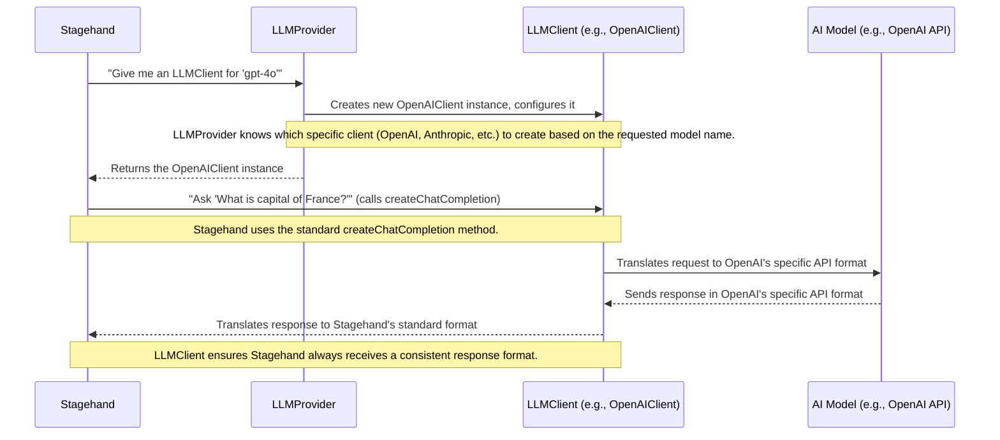

# Chapter 1: LLM Client & Provider

Welcome to the Stagehand tutorial! In this first chapter, we'll explore two fundamental building blocks of the Stagehand project: the `LLMClient` and the `LLMProvider`. Don't worry if these terms sound technical right now; we'll break them down with simple analogies.

## The Problem: Talking to Many AI Models

Imagine you have many different types of electronic devices, but each one needs a unique power adapter to plug into the wall. It would be a hassle to carry a different adapter for your laptop, phone, and tablet!

Large Language Models (LLMs) like OpenAI's GPT models, Anthropic's Claude, or Google's Gemini are similar. They are all powerful AI tools, but they each have their own specific way of communicating—their own "API" (Application Programming Interface). This means if Stagehand wanted to talk to OpenAI one day and Anthropic the next, it would have to learn two completely different "languages" or "dialects." This can get complicated very quickly when you want to support many different AI models.

## The Stagehand Solution: Universal Translators

Stagehand solves this problem using a clever system of "universal translators." This system allows Stagehand to speak a single, consistent language, and the translators handle the messy details of talking to each specific AI model.

This system has two main parts:

1.  **`LLMClient`**: Your "Specific Power Adapter" for one type of AI model.
2.  **`LLMProvider`**: Your "Power Adapter Factory" that gives you the right adapter.

Let's look at each one.

### Understanding the `LLMClient`: Your Specific Power Adapter

Think of an `LLMClient` as a specific power adapter. If you want to charge your laptop in Europe, you use a European adapter. If you're in the US, you use a US adapter. Both adapters let you charge your laptop, but they handle the different wall sockets (the AI models' unique APIs).

In Stagehand, an `LLMClient` is a specialized piece of code that knows how to communicate with *one specific type* of Large Language Model. For example:

*   `OpenAIClient` knows how to talk to OpenAI's models (like GPT-4o).
*   `AnthropicClient` knows how to talk to Anthropic's models (like Claude).
*   `GoogleClient` knows how to talk to Google's models (like Gemini).

The most important thing about all `LLMClient`s is that they provide a **standard way** for Stagehand to ask a question and get a response. This standard method is called `createChatCompletion`. Stagehand doesn't need to know the complex details of OpenAI's API versus Anthropic's; it just calls `createChatCompletion` and the `LLMClient` handles the translation.

You can see the common blueprint for all `LLMClient`s in the `lib/llm/LLMClient.ts` file. It defines what every `LLMClient` must be able to do:

```typescript
// lib/llm/LLMClient.ts (simplified)
export abstract class LLMClient {
  public modelName: string; // Like "gpt-4o" or "claude-3-5-sonnet-latest"

  constructor(modelName: string) {
    this.modelName = modelName;
  }

  // This is the universal method Stagehand uses to talk to any AI model
  abstract createChatCompletion<T>(options: {
    options: any; // Simplified for this tutorial
    logger: (message: any) => void;
    retries?: number;
  }): Promise<T>;

  // ... other methods that LLM clients can use for various AI tasks
}
```
In this code, `abstract` means `LLMClient` itself isn't a working client; it's like a template or a rulebook. Any actual client, like `OpenAIClient`, *must* follow these rules and provide its own specific version of `createChatCompletion`.

### Understanding the `LLMProvider`: Your Power Adapter Factory

Now, how does Stagehand get the *right* `LLMClient` for the AI model it wants to use? This is where the `LLMProvider` comes in.

The `LLMProvider` is like a "power adapter factory" or a "switchboard operator." Stagehand tells the `LLMProvider`, "I want to talk to the 'gpt-4o' model," and the `LLMProvider` knows exactly which `LLMClient` (in this case, an `OpenAIClient`) to create and give back to Stagehand.

This means Stagehand only ever needs to interact with the `LLMProvider` to get the correct `LLMClient`, without needing to manage which specific client goes with which model.

## How Stagehand Uses LLM Client & Provider

Let's walk through our use case: Stagehand wants to ask an AI model "What is the capital of France?".

Here's how Stagehand would typically use the `LLMProvider` and an `LLMClient` to achieve this:

```typescript
// How Stagehand uses LLMProvider and LLMClient
import { LLMProvider } from "./lib/llm/LLMProvider";

// Imagine we have a logger function to show messages
const myLogger = (message: any) => console.log(`Log: ${message.message}`);

async function askAIQuestion() {
  // 1. Create the LLM Provider (our "factory")
  // We enable caching (true) for better performance later.
  const provider = new LLMProvider(myLogger, true);

  // 2. Tell the provider which AI model we want to use
  // Let's say we choose OpenAI's gpt-4o model
  const client = provider.getClient("gpt-4o");

  // 3. Prepare our question (AI models understand "messages")
  const messages = [
    { role: "user", content: "What is the capital of France?" },
  ];

  // 4. Use the LLMClient's createChatCompletion method to ask the AI
  console.log("Stagehand is asking the AI...");
  const response = await client.createChatCompletion({
    options: { messages: messages, temperature: 0.7 }, // temperature controls creativity
    logger: myLogger,
  });

  // 5. Stagehand receives the AI's answer in a standard format
  const aiAnswer = response.choices[0].message.content;
  console.log("AI's answer:", aiAnswer);
  // Expected output (might vary slightly): "AI's answer: The capital of France is Paris."
}

// Run the example
askAIQuestion();
```
In this example:
*   We first create an `LLMProvider`.
*   Then, we ask the `provider` for an `LLMClient` specifically configured for `"gpt-4o"`. The `LLMProvider` gives us an `OpenAIClient`.
*   Finally, we use this `client` (which is an `OpenAIClient` under the hood, but Stagehand doesn't strictly need to know that!) to send our messages to the AI.

Notice how Stagehand only interacts with the standard `LLMClient` interface, keeping its code clean and adaptable to different AI models.

## Under the Hood: How it Works

Let's peek behind the curtain to see how `LLMProvider` and `LLMClient` collaborate.

Imagine the conversation flow:



Here's a breakdown of the process:

1.  **Stagehand Asks for a Client**: Stagehand needs to interact with an AI model. Instead of directly calling a specific AI library, it asks the `LLMProvider` for the appropriate `LLMClient`, specifying the desired model (e.g., `"gpt-4o"`).
2.  **Provider Selects and Creates**: The `LLMProvider` has an internal map (like a directory) that links model names (like `"gpt-4o"`) to their corresponding `LLMClient` type (like `OpenAIClient`). It then creates an instance of that specific `LLMClient`.
3.  **Client Configures**: The newly created `LLMClient` instance sets itself up to talk to its particular AI model (e.g., `OpenAIClient` initializes the actual OpenAI SDK library).
4.  **Client Returned**: The `LLMProvider` hands the ready-to-use `LLMClient` back to Stagehand.
5.  **Stagehand Communicates**: Stagehand now uses the returned `LLMClient`'s `createChatCompletion` method to send messages to the AI.
6.  **Client Translates & Sends**: The `LLMClient` takes Stagehand's standardized messages, translates them into the format that its specific AI model understands, and sends the request.
7.  **Client Receives & Translates Back**: When the AI model responds (in its unique format), the `LLMClient` receives it, translates it back into Stagehand's standardized response format, and returns it.

### Code Deep Dive: The LLMProvider's "Brain"

Let's look at a simplified version of the `LLMProvider`'s `getClient` method in `lib/llm/LLMProvider.ts`. This is where the magic of choosing the right `LLMClient` happens:

```typescript
// lib/llm/LLMProvider.ts (simplified)
import { LLMClient } from "./LLMClient";
import { OpenAIClient } from "./OpenAIClient";
import { AnthropicClient } from "./AnthropicClient";
import { GoogleClient } from "./GoogleClient";

// This map links specific model names to their general provider type
// Example: "gpt-4o" uses "openai" provider type
const modelToProviderMap = {
  "gpt-4o": "openai",
  "claude-3-5-sonnet-latest": "anthropic",
  "gemini-1.5-pro": "google",
  // ... many more entries for other models
};

export class LLMProvider {
  constructor(logger: any, enableCaching: boolean) { /* ... */ }

  getClient(modelName: string, clientOptions?: any): LLMClient {
    // 1. Find the provider type for the requested model name
    const providerType = modelToProviderMap[modelName];

    // 2. Use a switch to create the correct LLMClient
    switch (providerType) {
      case "openai":
        return new OpenAIClient({ modelName, clientOptions });
      case "anthropic":
        return new AnthropicClient({ modelName, clientOptions });
      case "google":
        return new GoogleClient({ modelName, clientOptions, logger: console.log });
      default:
        // If Stagehand asks for an unsupported model, it gets an error
        throw new Error(`Unsupported model provider for ${modelName}`);
    }
  }
}
```
The `modelToProviderMap` is like the `LLMProvider`'s brain. When you ask for `"gpt-4o"`, it looks up `"gpt-4o"` in the map, sees that it's an `"openai"` type, and then the `switch` statement creates and returns a new `OpenAIClient`.

### Code Deep Dive: An LLMClient in Action (OpenAIClient)

Now, let's briefly look inside an actual `LLMClient`, specifically the `OpenAIClient` (from `lib/llm/OpenAIClient.ts`). This is where the "translation" work happens:

```typescript
// lib/llm/OpenAIClient.ts (simplified createChatCompletion method)
import OpenAI from "openai";
import { LLMClient } from "./LLMClient"; // Our common blueprint

export class OpenAIClient extends LLMClient {
  private client: OpenAI; // The actual OpenAI library client

  constructor(config: any) { // Simplified config for tutorial
    super(config.modelName);
    this.client = new OpenAI(config.clientOptions); // Initializes OpenAI's SDK
  }

  async createChatCompletion<T>(options: any): Promise<T> {
    // 1. Take Stagehand's messages and format them for OpenAI's API
    const formattedMessages = options.options.messages.map(msg => ({
      role: msg.role,
      content: msg.content,
    }));

    // 2. Make the actual call using OpenAI's library
    const apiResponse = await this.client.chat.completions.create({
      model: this.modelName,
      messages: formattedMessages,
      temperature: options.options.temperature,
      // ... other OpenAI specific options like tool definitions
    });

    // 3. Transform OpenAI's specific response into Stagehand's standard format
    const stagehandResponse = {
      id: apiResponse.id,
      object: "chat.completion",
      created: Date.now(),
      model: apiResponse.model,
      choices: apiResponse.choices.map(choice => ({
        index: choice.index,
        message: choice.message,
        finish_reason: choice.finish_reason,
      })),
      usage: apiResponse.usage,
    };

    return stagehandResponse as T; // Return the standardized response
  }
}
```
This `OpenAIClient` is a concrete example of an `LLMClient`. It extends the `LLMClient` blueprint and provides its unique implementation of `createChatCompletion`. It uses the official `openai` library to make the actual API calls. It also handles transforming messages *to* OpenAI's format and transforming OpenAI's responses *back* into Stagehand's standard `LLMResponse` format.

This ensures that no matter which `LLMClient` Stagehand uses, the output format is always consistent, making the rest of Stagehand's code simpler and more robust.

## Summary

To recap what we've learned:

| Concept       | Analogy                | Role in Stagehand                                                 | Key Responsibility              |
| :------------ | :--------------------- | :---------------------------------------------------------------- | :------------------------------ |
| `LLMClient`   | Specific Power Adapter | Translates Stagehand's requests to a specific AI model's API      | Standardized `createChatCompletion` method for one AI type |
| `LLMProvider` | Power Adapter Factory  | Provides Stagehand with the correct `LLMClient` instance          | Selecting and creating the right `LLMClient` |

This modular design means that Stagehand can easily add support for new AI models in the future by simply creating a new `LLMClient` for that model and adding it to the `LLMProvider`'s map, without changing any of Stagehand's core logic.

Now that you understand how Stagehand communicates with Large Language Models, you're ready to learn about how Stagehand actually orchestrates actions and processes information.

[Next Chapter: Stagehand Orchestrator](02_stagehand_orchestrator_.md)

---

<sub><sup>Generated by [AI Codebase Knowledge Builder](https://github.com/The-Pocket/Tutorial-Codebase-Knowledge).</sup></sub> <sub><sup>**References**: [[1]](https://github.com/browserbase/stagehand/blob/8de7bd8635c2051cd8025e365c6c8aa83d81c7e7/lib/llm/AnthropicClient.ts), [[2]](https://github.com/browserbase/stagehand/blob/8de7bd8635c2051cd8025e365c6c8aa83d81c7e7/lib/llm/CerebrasClient.ts), [[3]](https://github.com/browserbase/stagehand/blob/8de7bd8635c2051cd8025e365c6c8aa83d81c7e7/lib/llm/GoogleClient.ts), [[4]](https://github.com/browserbase/stagehand/blob/8de7bd8635c2051cd8025e365c6c8aa83d81c7e7/lib/llm/GroqClient.ts), [[5]](https://github.com/browserbase/stagehand/blob/8de7bd8635c2051cd8025e365c6c8aa83d81c7e7/lib/llm/LLMClient.ts), [[6]](https://github.com/browserbase/stagehand/blob/8de7bd8635c2051cd8025e365c6c8aa83d81c7e7/lib/llm/LLMProvider.ts), [[7]](https://github.com/browserbase/stagehand/blob/8de7bd8635c2051cd8025e365c6c8aa83d81c7e7/lib/llm/OpenAIClient.ts), [[8]](https://github.com/browserbase/stagehand/blob/8de7bd8635c2051cd8025e365c6c8aa83d81c7e7/lib/llm/aisdk.ts), [[9]](https://github.com/browserbase/stagehand/blob/8de7bd8635c2051cd8025e365c6c8aa83d81c7e7/types/llm.ts), [[10]](https://github.com/browserbase/stagehand/blob/8de7bd8635c2051cd8025e365c6c8aa83d81c7e7/types/model.ts)</sup></sub>