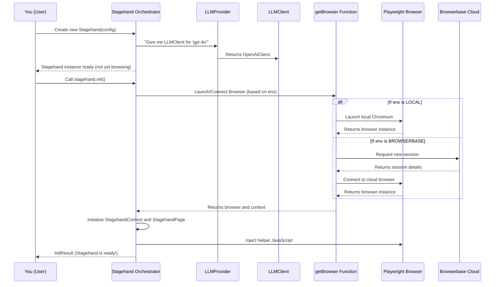

# Chapter 2: Stagehand Orchestrator

Welcome back to the Stagehand tutorial! In the [previous chapter: LLM Client & Provider](01_llm_client___provider_.md), we learned how Stagehand intelligently talks to different AI models using `LLMClient` and `LLMProvider`. Now, let's explore the heart of Stagehand: the `Stagehand Orchestrator`.

## The Problem: Orchestrating the Entire Automation

Imagine you want to put on a grand musical performance. You have all the talented musicians (your AI models, thanks to `LLMClient`s!) and their instruments. But who tells them when to play, what tempo to follow, and how to blend their sounds? You also need a stage, lighting, and maybe even a cloud-based streaming service for a global audience!

In browser automation, it's very similar. You need to:
*   Open a web browser (locally on your computer or in the cloud).
*   Tell the browser where to go (a specific web page).
*   Interact with elements on the page (click buttons, type text).
*   Understand what's on the page (read text, identify links).
*   And most importantly, use AI to make smart decisions about what to do next!

This whole process requires a central control unit that sets everything up, manages the browser, connects to the AI, and coordinates all the complex interactions. Without it, everything would be a chaotic mess!

## The Stagehand Solution: The Conductor of the Automation

This is where the `Stagehand Orchestrator` comes in. In the Stagehand project, this "orchestrator" is represented by the main `Stagehand` class. It's like the conductor of an orchestra, or the mission control center for your browser automation.

When you start any automation task with Stagehand, you begin by creating an instance of this `Stagehand` class. It's responsible for:
*   **Setting up the browser**: Deciding if it runs locally or in the cloud (using Browserbase).
*   **Managing AI communication**: It already knows how to get the right [LLMClient](01_llm_client___provider_.md) because you tell it which AI model you want to use.
*   **Coordinating all operations**: It's the central hub that brings together browser interactions, AI decisions, and data extraction.

Let's look at a simple use case: **Starting a browser automation environment and getting it ready to interact with a website.**

## How to Use the Stagehand Orchestrator

To begin any Stagehand automation, your first step is always to create a `Stagehand` instance and then initialize it.

### Step 1: Create a Stagehand Instance

You create a `Stagehand` instance by using its `constructor`. You can tell it a few important things right away, like where to run the browser and which AI model to use.

```typescript
import { Stagehand } from "@browserbasehq/stagehand";

// Imagine you have your API keys in a .env file or directly
// process.env.BROWSERBASE_API_KEY = "your_browserbase_api_key";
// process.env.BROWSERBASE_PROJECT_ID = "your_browserbase_project_id";
// process.env.OPENAI_API_KEY = "your_openai_api_key";

// Create the Stagehand Orchestrator
const stagehand = new Stagehand({
  env: "BROWSERBASE", // Where to run the browser: "LOCAL" or "BROWSERBASE"
  modelName: "gpt-4o", // The AI model for smart decisions
  headless: true, // Run browser in background (no visible window)
  verbose: 1, // Show basic logs
});
```

In this code:
*   We `import` the `Stagehand` class.
*   We create a `new Stagehand()` instance.
*   `env: "BROWSERBASE"` tells Stagehand to use a cloud browser provided by Browserbase. You could also set `env: "LOCAL"` to use a browser on your own machine.
*   `modelName: "gpt-4o"` tells Stagehand to use OpenAI's GPT-4o model for its AI brain. This will internally trigger the [LLMProvider](01_llm_client___provider_.md) to get the correct [LLMClient](01_llm_client___provider_.md) for `gpt-4o`.
*   `headless: true` means the browser window won't pop up; it runs quietly in the background.
*   `verbose: 1` means Stagehand will log important information to your console.

### Step 2: Initialize Stagehand

After creating the `Stagehand` instance, you need to `init()` it. This is like the conductor tapping their baton – it's when the magic actually starts! `init()` tells Stagehand to launch or connect to the browser and get everything ready.

```typescript
// ... (previous code)

async function runAutomation() {
  const stagehand = new Stagehand({
    env: "BROWSERBASE",
    modelName: "gpt-4o",
    headless: true,
    verbose: 1,
  });

  console.log("Stagehand is preparing the environment...");

  // Initialize Stagehand - this starts the browser and sets up AI
  const initResult = await stagehand.init();

  console.log("Stagehand is ready!");
  console.log("Browserbase Session URL:", initResult.sessionUrl);

  // Now you can start interacting with web pages!
  // (We'll cover this in the next chapter!)

  // Don't forget to close Stagehand when you're done!
  await stagehand.close();
  console.log("Stagehand environment closed.");
}

runAutomation();
```

**Expected Output (console):**

```
Stagehand is preparing the environment...
Log: { category: 'init', message: 'creating new browserbase session...', level: 1 }
Log: { category: 'init', message: 'created new browserbase session', level: 1, auxiliary: { ... } }
Log: { category: 'init', message: 'connecting to browserbase session', level: 1, auxiliary: { ... } }
Log: { category: 'init', message: 'browserbase session started', auxiliary: { ... } }
Stagehand is ready!
Browserbase Session URL: https://www.browserbase.com/sessions/your-session-id
Stagehand environment closed.
```

If you set `env: "LOCAL"` and `headless: false`, you would see a browser window open up on your computer instead of a session URL.

## Under the Hood: How Stagehand Orchestrates

Let's peek behind the curtain to understand what happens when you create and initialize `Stagehand`.

### Non-Code Walkthrough

1.  **Creating `new Stagehand()`**:
    *   When you create a `Stagehand` instance, it first reads your configuration (like `env`, `modelName`, `apiKey`).
    *   It then creates an internal `StagehandLogger` for logging messages.
    *   Crucially, it uses the [LLMProvider](01_llm_client___provider_.md) to get the right [LLMClient](01_llm_client___provider_.md) based on your `modelName`. So, the AI communication part is prepared.
    *   It *doesn't* start the browser yet.

2.  **Calling `await stagehand.init()`**:
    *   This is the heavy lifting part!
    *   **Browser Setup**: Stagehand checks your `env` setting.
        *   If `BROWSERBASE`, it contacts the Browserbase API to create a new cloud browser session (or connect to an existing one).
        *   If `LOCAL`, it launches a local browser on your computer using Playwright.
        *   This step returns a browser instance and a "context" (think of it like a new tab in the browser, but more isolated).
    *   **Context and Page Setup**: Stagehand takes this browser context and wraps it with its own internal helper classes, `StagehandContext` and `StagehandPage`. These are special versions of Playwright's browser objects that Stagehand uses to add its unique AI-driven capabilities. You'll learn more about [Stagehand Page](03_stagehand_page_.md) in the next chapter.
    *   **Script Injection**: It injects special JavaScript code into the browser. This code helps Stagehand understand the web page better and prepares it for AI-driven actions.
    *   **Ready for Action**: Once all these steps are complete, Stagehand is fully initialized and ready for you to tell it what to do on the web.

Here's a simplified flow:



### Code Deep Dive: The `Stagehand` Class

Let's look at simplified versions of the `Stagehand` constructor and `init` method from `lib/index.ts` to see how these concepts translate into code.

#### `Stagehand` Constructor (Simplified)

```typescript
// lib/index.ts (simplified Stagehand constructor)
import { LLMProvider } from "./llm/LLMProvider";
import { StagehandLogger } from "./logger";

export class Stagehand {
  public llmProvider: LLMProvider;
  public llmClient: LLMClient; // The LLMClient from Chapter 1
  private _env: "LOCAL" | "BROWSERBASE";
  private stagehandLogger: StagehandLogger;
  private modelName: AvailableModel; // The chosen AI model name

  constructor(
    {
      env,
      modelName,
      llmProvider, // Can be provided or created internally
      modelClientOptions,
      logger,
      disablePino,
      // ... other configuration options ...
    }: ConstructorParams = { env: "BROWSERBASE" },
  ) {
    // 1. Set up the logger
    this.stagehandLogger = new StagehandLogger({ pretty: true, usePino: !logger && !disablePino }, logger);
    this._env = env ?? "BROWSERBASE";
    this.modelName = modelName ?? "openai/gpt-4o"; // Default AI model

    // 2. Prepare the LLMProvider and LLMClient (from Chapter 1)
    this.llmProvider = llmProvider || new LLMProvider(this.logger, true);
    try {
      this.llmClient = this.llmProvider.getClient(this.modelName, modelClientOptions);
    } catch (error) {
      // Handle cases where LLM client cannot be set
      this.llmClient = undefined;
    }

    // ... set up other properties like API keys, timeouts, etc.
  }

  // ... other methods ...
}
```
The constructor primarily sets up the initial configuration and prepares the `LLMClient` that Stagehand will use for AI communication. It doesn't start the browser yet.

#### `Stagehand.init()` Method (Simplified)

```typescript
// lib/index.ts (simplified Stagehand.init() method)
import { getBrowser } from "./lib/index"; // This function handles browser launch/connection
import { StagehandContext } from "./StagehandContext";
import { StagehandPage } from "./StagehandPage";

async init(): Promise<InitResult> {
    // ... (API mode initialization - if using Stagehand API for cloud operations)

    // 1. Get the browser instance (local or Browserbase)
    const { browser, context, debugUrl, sessionUrl, sessionId } =
      await getBrowser(
        this.apiKey,
        this.projectId,
        this.env,
        this.headless,
        this.logger,
        this.browserbaseSessionCreateParams,
        this.browserbaseSessionID,
        this.localBrowserLaunchOptions,
      );

    // If browser connection failed, throw an error
    if (!context) {
      throw new StagehandInitError("The browser context is undefined.");
    }

    // 2. Initialize the StagehandContext
    this.stagehandContext = await StagehandContext.init(context, this);

    // 3. Get the default StagehandPage
    const defaultPage = (await this.stagehandContext.getStagehandPages())[0];
    this.stagehandPage = defaultPage;

    // 4. Inject Stagehand's helper JavaScript into the browser
    await this.context.addInitScript({ content: scriptContent });

    // ... set up download behavior and other browser settings ...

    // 5. Return useful session details
    return { debugUrl, sessionUrl, sessionId };
  }
```

The `init()` method is where Stagehand connects to or launches the browser via the `getBrowser` function. It then wraps the raw browser `context` and `page` objects with Stagehand's own `StagehandContext` and `StagehandPage` classes. These wrapper classes add all the powerful AI-driven capabilities to your browser interactions.

After `init()` completes, your `Stagehand` instance will have a `page` property (`stagehand.page`) and a `context` property (`stagehand.context`) that you can use to interact with the browser. You will learn more about `stagehand.page` in the next chapter.

## Summary

| Concept              | Analogy                        | Role in Stagehand                                             | Key Responsibility                               |
| :------------------- | :----------------------------- | :------------------------------------------------------------ | :----------------------------------------------- |
| `Stagehand` (Class) | The Orchestra Conductor        | Central control unit for all browser automation operations. | Setting up browser, managing AI, coordinating tasks. |
| `new Stagehand()`    | Hiring the Conductor           | Configures Stagehand with environment and AI model choices.   | Initial setup of properties and AI client.       |
| `stagehand.init()`   | Tapping the Baton              | Launches/connects to the browser and prepares it for actions. | Getting the browser and AI ready for interaction. |

You now understand that the `Stagehand` class is your starting point for any automation. It's the "brain" that gets everything ready, from choosing the right AI model to launching and configuring your browser.

In the next chapter, we'll dive into the `Stagehand Page` and explore how you can actually start navigating and interacting with web pages!

[Next Chapter: Stagehand Page](03_stagehand_page_.md)

---

<sub><sup>Generated by [AI Codebase Knowledge Builder](https://github.com/The-Pocket/Tutorial-Codebase-Knowledge).</sup></sub> <sub><sup>**References**: [[1]](https://github.com/browserbase/stagehand/blob/8de7bd8635c2051cd8025e365c6c8aa83d81c7e7/lib/index.ts), [[2]](https://github.com/browserbase/stagehand/blob/8de7bd8635c2051cd8025e365c6c8aa83d81c7e7/stagehand.config.ts), [[3]](https://github.com/browserbase/stagehand/blob/8de7bd8635c2051cd8025e365c6c8aa83d81c7e7/types/stagehand.ts)</sup></sub>