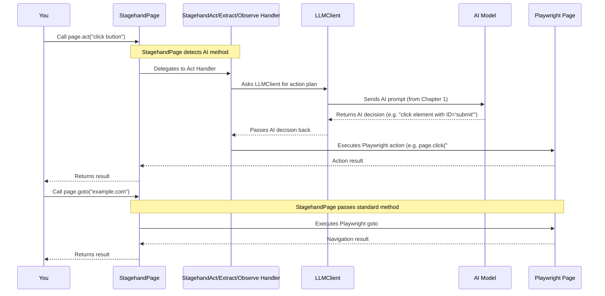

# Chapter 3: Stagehand Page

Welcome back! In the [previous chapter: Stagehand Orchestrator](02_stagehand_orchestrator_.md), we learned how the `Stagehand` class acts as your central "conductor," setting up the browser and connecting to the AI models. Now that you have your browser environment ready, the next big question is: **How do you actually tell the browser what to do on a webpage?**

## The Problem: Making Your Browser Smart and Interactive

Imagine you've launched a super-advanced robot assistant. You've taught it how to connect to the internet, but now you need it to open a specific website and perform tasks there, like finding information or clicking buttons.

Traditionally, with a tool like Playwright, you'd have to write very specific instructions: "Find this button by its exact name," or "type text into this specific box." This works, but it can be rigid. What if the website changes slightly? What if you want the robot to figure things out for itself based on a general goal?

For example, your goal might be: "Go to a search engine, find the search bar, type 'Stagehand project' into it, and then click the search button." Doing this purely with traditional code requires you to know the exact "selector" (like an ID or class name) of the search bar and button, which can be brittle.

## The Stagehand Solution: Your Smart Browser Tab

This is where the `Stagehand Page` comes in! Think of a `Stagehand Page` as your **AI-powered assistant for a single browser tab.** It's like having a regular web browser tab, but this one has a built-in brain that understands your high-level instructions and can make smart decisions.

Behind the scenes, the `Stagehand Page` is an enhanced version of Playwright's standard `Page` object. This means you can still use all the familiar Playwright commands (like `goto`, `click`, `fill`, `screenshot`), but Stagehand adds powerful AI-driven methods:

*   **`act`**: To perform actions based on your instructions.
*   **`extract`**: To pull specific data from the page.
*   **`observe`**: To understand what's on the page.

Let's see how `Stagehand Page` helps us achieve our goal: "Navigate to a search engine, find the search bar, type 'Stagehand project' into it, and then click the search button."

## How to Use the Stagehand Page

When you initialize your `Stagehand` orchestrator, it automatically creates a default `Stagehand Page` for you. You can access it through `stagehand.page`.

```typescript
import { Stagehand } from "@browserbasehq/stagehand";

async function automateSearch() {
  const stagehand = new Stagehand({
    env: "LOCAL", // Run browser locally for this example
    modelName: "gpt-4o",
    headless: false, // Show the browser window
    verbose: 1,
  });

  // 1. Initialize Stagehand to get the browser ready
  await stagehand.init();
  console.log("Stagehand is ready with its smart page!");

  // The 'stagehand.page' is our Stagehand Page instance!

  // Don't forget to close when done!
  await stagehand.close();
}

automateSearch();
```

Now, let's break down our search example using the `stagehand.page` object.

### Step 1: Navigate to a Website (`page.goto`)

This is a standard Playwright function, and Stagehand's `page` object supports it directly.

```typescript
// ... (inside automateSearch function)

  // Navigate to Google
  console.log("Navigating to Google...");
  await stagehand.page.goto("https://www.google.com");
  console.log("Arrived at Google!");

// ... (rest of the function)
```
After this, the browser will open `google.com`.

### Step 2: Understand the Page (`page.observe`)

Now, we need to find the search bar. Instead of manually inspecting the page for its ID, we can ask our `Stagehand Page`'s AI to *observe* the page and tell us about the search bar.

```typescript
// ... (inside automateSearch function, after goto)

  // Ask Stagehand to observe and find the search bar
  console.log("Asking Stagehand to find the search bar...");
  const observations = await stagehand.page.observe(
    "find the main search bar on the page",
  );

  // The 'observations' variable will contain a list of things the AI found.
  // We expect the first result to be our search bar.
  const searchBar = observations[0];
  console.log("Found search bar:", searchBar.description);

  // Expected output for 'searchBar.description' might be: "Search or type URL"

// ... (rest of the function)
```
The `observe` method returns an array of `ObserveResult` objects. Each result tells you what the AI found (`description`), where it is (`selector`), and what kind of action you might take (`method`). This is crucial for the next step.

### Step 3: Perform Actions (`page.act`)

Once we know about the search bar, we can tell the `Stagehand Page` to `act` on it. The `act` method is incredibly powerful because it understands your high-level instructions or the `ObserveResult` from `observe`.

**Option A: Using a high-level instruction (string)**

You can just tell the AI what you want to do:

```typescript
// ... (inside automateSearch function, after observe)

  // Tell Stagehand to type into the search bar and click a button
  console.log("Typing 'Stagehand project' and clicking search...");
  await stagehand.page.act("type 'Stagehand project' into the search bar");
  await stagehand.page.act("click the search button");
  console.log("Search performed!");

// ... (rest of the function)
```
Stagehand's AI will figure out *which* search bar to type into and *which* button to click based on your instruction and its understanding of the page. This is the magic of AI-driven automation!

**Option B: Using an `ObserveResult` (more precise)**

If you already have an `ObserveResult` from `observe` (like our `searchBar` variable), you can use it for more precise actions.

```typescript
// ... (inside automateSearch function, after observe)

  // Using the precise searchBar object from 'observe'
  console.log("Typing 'Stagehand project' into the found search bar...");
  await stagehand.page.act({
    instruction: "type 'Stagehand project'",
    selector: searchBar.selector, // Use the selector from observe
    method: searchBar.method,     // Use the method from observe (e.g., 'type')
  });

  // Find the search button (another observe call, or assume its presence)
  const searchButtonObservations = await stagehand.page.observe(
    "find the button to perform the search",
  );
  const searchButton = searchButtonObservations[0];

  console.log("Clicking the search button...");
  await stagehand.page.act(searchButton); // Directly pass the ObserveResult
  console.log("Search performed!");

// ... (rest of the function)
```
This demonstrates how `observe` and `act` can work together for more controlled AI interactions. For beginners, the string-based `act` is often sufficient and easier!

Here's the complete simple example for our use case:

```typescript
import { Stagehand } from "@browserbasehq/stagehand";

async function automateSearch() {
  const stagehand = new Stagehand({
    env: "LOCAL", // Run browser locally for this example
    modelName: "gpt-4o",
    headless: false, // Show the browser window
    verbose: 1,
  });

  await stagehand.init();
  console.log("Stagehand is ready with its smart page!");

  // 1. Navigate to Google
  console.log("Navigating to Google...");
  await stagehand.page.goto("https://www.google.com");
  console.log("Arrived at Google!");

  // 2. Type 'Stagehand project' into the search bar and click search
  console.log("Asking Stagehand to search for 'Stagehand project'...");
  await stagehand.page.act("type 'Stagehand project' into the search bar and press enter");
  console.log("Search performed!");

  // 3. (Optional) Extract the main heading from the results page
  console.log("Extracting main heading from results...");
  const resultHeading = await stagehand.page.extract(
    "What is the main heading on this page?"
  );
  console.log("Main heading:", resultHeading.extraction);

  // Don't forget to close when done!
  await stagehand.close();
  console.log("Automation finished and browser closed.");
}

automateSearch();
```

**Expected behavior:** A browser window will open, navigate to Google, type "Stagehand project" into the search bar, press Enter, and then print the main heading of the search results page to your console (e.g., "All" or "Stagehand Project - GitHub").

### Step 4: Extract Data (`page.extract`)

While not strictly part of our initial search problem, `extract` is another core AI superpower of `Stagehand Page`. It allows you to ask the AI to pull specific information from the webpage.

```typescript
// ... (after search is performed)

  // Extract the main heading from the results page
  console.log("Extracting main heading from results...");
  const resultHeading = await stagehand.page.extract(
    "What is the main heading on this page?"
  );
  console.log("Main heading:", resultHeading.extraction);

// ...
```
You can also provide a structured way to extract data using a "schema," which helps the AI return data in a predictable format, but that's for more advanced use cases.

## Under the Hood: How Stagehand Page Works Its Magic

The `Stagehand Page` is where Playwright's browser control meets Stagehand's AI capabilities.

### Non-Code Walkthrough: The Proxy Layer

1.  **Stagehand Orchestrator's Role**: When `stagehand.init()` is called, the `Stagehand Orchestrator` first gets a regular Playwright browser `page` object.
2.  **The `StagehandPage` Wrapper**: Instead of giving you the raw Playwright `page`, Stagehand creates a special `StagehandPage` object. This `StagehandPage` "wraps" or "proxies" the original Playwright `page`. Think of it like a smart filter.
3.  **Intercepting Calls**: When you call a method on `stagehand.page` (e.g., `page.act()`, `page.goto()`, `page.click()`):
    *   **For `act`, `extract`, `observe`**: The `StagehandPage` recognizes these as its special AI methods. It then takes your instruction, combines it with information about the current web page (which it gets using internal Playwright capabilities), and sends this to the appropriate "AI Action Handler" (like `StagehandActHandler`). These handlers then communicate with the [LLMClient](01_llm_client___provider_.md) to get AI's decisions.
    *   **For standard Playwright methods (e.g., `goto`, `click`)**: The `StagehandPage` simply passes these calls directly to the underlying Playwright `page` object. It might add a little extra logic (like waiting for the page to settle after navigation or handling popups), but the core action is still performed by Playwright.

This setup ensures that you get the best of both worlds: the reliability and control of Playwright, plus the intelligent decision-making of AI.

Here's a simplified flow:



### Code Deep Dive: The `StagehandPage` Class

Let's look at a simplified version of the `StagehandPage` class (from `lib/StagehandPage.ts`).

#### `StagehandPage` Constructor (Simplified)

```typescript
// lib/StagehandPage.ts (simplified constructor)
import type { Page as PlaywrightPage } from "playwright";
import { Stagehand } from "./index"; // Our main Orchestrator
import { StagehandContext } from "./StagehandContext";
import { LLMClient } from "./llm/LLMClient";
import { StagehandActHandler } from "./handlers/actHandler";
import { StagehandExtractHandler } from "./handlers/extractHandler";
import { StagehandObserveHandler } from "./handlers/observeHandler";

export class StagehandPage {
  private rawPage: PlaywrightPage; // The original Playwright page
  private intPage: Page;           // The proxied/enhanced page
  private llmClient: LLMClient;
  private actHandler: StagehandActHandler; // For AI actions
  private extractHandler: StagehandExtractHandler; // For AI data extraction
  private observeHandler: StagehandObserveHandler; // For AI observation

  constructor(
    page: PlaywrightPage,
    stagehand: Stagehand, // Reference to the orchestrator
    context: StagehandContext,
    llmClient: LLMClient,
    // ... other options ...
  ) {
    this.rawPage = page;
    this.llmClient = llmClient;

    // Create a Proxy around the raw Playwright page.
    // This allows us to "intercept" calls to methods like act/extract/observe.
    this.intPage = new Proxy(page, {
      get: (target: PlaywrightPage, prop: keyof PlaywrightPage) => {
        // We'll add logic to handle 'act', 'extract', 'observe' in init()
        // For now, other methods (like 'goto', 'click') just pass through.
        const value = target[prop];
        if (typeof value === "function") {
          return (...args: unknown[]) => value.apply(target, args);
        }
        return value;
      },
    }) as Page; // Our custom Stagehand Page type

    // Initialize the AI action handlers
    this.actHandler = new StagehandActHandler({ /* ... */ });
    this.extractHandler = new StagehandExtractHandler({ /* ... */ });
    this.observeHandler = new StagehandObserveHandler({ /* ... */ });
  }

  // Public getter to access the enhanced page
  public get page(): Page {
    return this.intPage;
  }

  // ... other methods like init(), act(), extract(), observe() ...
}
```
The constructor sets up the `StagehandPage` by taking the `rawPage` (from Playwright) and wrapping it with a `Proxy`. It also creates instances of the `Act`, `Extract`, and `Observe` handlers, which are responsible for the AI logic.

#### `StagehandPage.init()` Method (Simplified)

The `init()` method is where the `StagehandPage` truly becomes "smart" by adding the logic to intercept and handle `act`, `extract`, and `observe` calls, as well as enhancing `goto`.

```typescript
// lib/StagehandPage.ts (simplified init method)

async init(): Promise<StagehandPage> {
    const page = this.rawPage;

    // The handler object defines how calls to this.intPage are treated
    const handler = {
      get: (target: PlaywrightPage, prop: string | symbol) => {
        const value = target[prop as keyof PlaywrightPage];

        // --- Important: Intercept our AI-driven methods ---
        if (prop === "act" || prop === "extract" || prop === "observe") {
          // If these methods are called, instead of Playwright's method,
          // we return OUR custom implementation that uses AI Handlers.
          const method = this[prop as keyof StagehandPage]; // Get StagehandPage's own method
          return (options: unknown) => (method as Function).call(this, options);
        }

        // --- Enhance standard Playwright methods like 'goto' ---
        if (prop === "goto") {
          const rawGoto: typeof target.goto = Object.getPrototypeOf(target).goto.bind(target);
          return async (url: string, options: any) => {
            // Stagehand's custom logic for 'goto' (e.g., captcha solving)
            const result = await rawGoto(url, options); // Call original Playwright goto
            await this._waitForSettledDom(); // Wait for page to fully load
            return result;
          };
        }

        // --- For all other methods (like click, fill, screenshot, etc.) ---
        // Just pass the call through to the original Playwright page.
        if (typeof value === "function") {
          return (...args: unknown[]) => value.apply(target, args);
        }
        return value;
      },
    };

    // Re-assign intPage with the new proxy handler after initialization
    this.intPage = new Proxy(page, handler) as unknown as Page;
    this.initialized = true;
    return this;
  }

  // Simplified act method showing delegation
  async act(actionOrOptions: string | ActOptions | ObserveResult): Promise<ActResult> {
    if (!this.actHandler) { /* throw error */ }
    // Logic to prepare input and then delegate to the AI Act Handler
    const result = await this.actHandler.observeAct(/* ... */);
    return result;
  }

  // Similar methods for extract() and observe()
  // ...
}
```
The `init()` method creates the powerful `Proxy` around the `rawPage`. This `Proxy` is like a gatekeeper:
*   If `act`, `extract`, or `observe` are called, it diverts the call to the `StagehandPage`'s own AI-driven methods.
*   If `goto` is called, it adds extra Stagehand logic before and after calling Playwright's `goto`.
*   For all other standard Playwright methods, it simply lets the call pass through to the underlying `rawPage`.

This seamless integration makes `Stagehand Page` extremely flexible, allowing you to choose between precise Playwright control and intelligent AI automation, all within the same object.

## Summary

| Concept           | Analogy                  | Role in Stagehand                                             | Key Responsibility                          |
| :---------------- | :----------------------- | :------------------------------------------------------------ | :------------------------------------------ |
| `Stagehand Page`  | Your Smart Browser Tab   | The primary interface for interacting with web pages.         | Enhancing Playwright Page with AI methods.  |
| `page.act()`      | "Tell AI to do it"       | Commands the AI to perform an action on the page.             | Performing intelligent actions.             |
| `page.extract()`  | "Ask AI for data"        | Commands the AI to pull specific data from the page.          | Intelligently extracting information.       |
| `page.observe()`  | "Ask AI what's here"     | Commands the AI to understand elements and actions on the page. | Understanding page content and capabilities. |

The `Stagehand Page` empowers you to control your browser with both precise, traditional methods and powerful, high-level AI instructions. It's the central point for all your web interactions.

Now that you understand how to control a single browser page, you might be wondering: How does Stagehand's AI actually "see" and "understand" the web content to make its decisions? That's what we'll explore in the next chapter!

[Next Chapter: Web Content Representation (Accessibility Tree)](04_web_content_representation__accessibility_tree__.md)

---

<sub><sup>Generated by [AI Codebase Knowledge Builder](https://github.com/The-Pocket/Tutorial-Codebase-Knowledge).</sup></sub> <sub><sup>**References**: [[1]](https://github.com/browserbase/stagehand/blob/8de7bd8635c2051cd8025e365c6c8aa83d81c7e7/lib/StagehandContext.ts), [[2]](https://github.com/browserbase/stagehand/blob/8de7bd8635c2051cd8025e365c6c8aa83d81c7e7/lib/StagehandPage.ts), [[3]](https://github.com/browserbase/stagehand/blob/8de7bd8635c2051cd8025e365c6c8aa83d81c7e7/types/page.ts)</sup></sub>