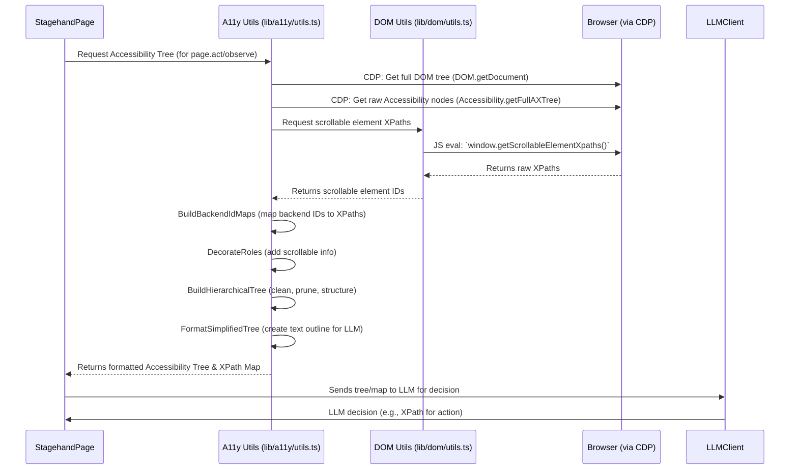

# Chapter 4: Web Content Representation (Accessibility Tree)

Welcome back! In the [previous chapter: Stagehand Page](03_stagehand_page_.md), you learned how `Stagehand Page` acts as your smart browser tab, allowing you to `act`, `extract`, and `observe` information on web pages using AI. But have you ever wondered how Stagehand's AI actually "sees" and "understands" a web page? It doesn't have eyes like you or me!

## The Problem: How AI Understands a Webpage

Imagine you're trying to describe a complex building to someone over the phone who can't see it. You wouldn't read out every single brick, wire, or pipe. Instead, you'd describe the important parts: "There's a main entrance here, a reception desk there, and a long hallway leading to offices."

Web pages are similar. They are built using complex HTML, CSS, and JavaScript, forming what developers call the "Document Object Model" (DOM). The DOM is like the complete blueprint of every single brick and wire in our building analogy – it's incredibly detailed, but often too much information for an AI model that needs to make quick decisions.

For an AI to perform tasks like "click the search bar" or "find the product price," it needs a simplified, meaningful representation of the page, focusing only on the visible and interactive elements, and understanding their purpose. How does it know what a "search bar" is among thousands of lines of HTML?

## The Stagehand Solution: The Accessibility Tree (Simplified View)

Stagehand solves this problem by converting the complex web page (DOM) into something called an **"Accessibility Tree."** Think of the Accessibility Tree as a **highly simplified, meaningful "table of contents" or "blueprint" of the web page**, specifically designed for AI to understand.

Here's what this "blueprint" does:

*   **Simplifies Complexity**: It strips away all the hidden or purely decorative parts of the page, focusing only on elements that are visible and potentially interactive (like buttons, links, text fields, headings).
*   **Assigns Roles**: Instead of just showing HTML tags (like `<div>` or `<span>`), it assigns *roles* to elements that describe their purpose (e.g., "button," "link," "text input," "heading," "checkbox").
*   **Provides Names/Descriptions**: It includes the visible text labels or `aria-label` attributes that give context to elements (e.g., a button might have the name "Search," or a text input might have the placeholder "Enter your query").
*   **Precise Locations (XPaths)**: For every important element, it generates a unique "XPath." An XPath is like a precise address that tells Stagehand *exactly* where that element is located on the page. This is crucial for Stagehand to click, type, or extract information from the correct spot.
*   **AI-Friendly Format**: All this information is then put together into a structured text format that Large Language Models (LLMs) can easily read and interpret.

## How Stagehand Uses the Accessibility Tree (Behind the Scenes)

You don't directly create or interact with the Accessibility Tree yourself when using Stagehand. Instead, it's a core internal component that powers the smart methods of your `Stagehand Page` object.

Let's revisit our search example from [Chapter 3: Stagehand Page](03_stagehand_page_.md):

```typescript
// From Chapter 3: Stagehand Page
await stagehand.page.act("type 'Stagehand project' into the search bar");
```

When you call `stagehand.page.act(...)` or `stagehand.page.observe(...)`, here's (simplified) what happens internally:

1.  **Stagehand Gets the Raw Data**: Your browser (managed by Stagehand) provides the raw DOM and accessibility information about the current page.
2.  **Building the Accessibility Tree**: Stagehand processes this raw data to build the simplified Accessibility Tree. It identifies all the important elements (like the search bar), figures out their roles and names, and generates unique XPaths for each.
3.  **Sending to AI**: This simplified Accessibility Tree (often as a structured text string) is then sent to the AI model (via the [LLMClient](01_llm_client___provider_.md)).
4.  **AI Makes a Decision**: The AI, given your instruction ("type 'Stagehand project' into the search bar") and the Accessibility Tree, "understands" the page. It can then identify the XPath of the correct search bar element.
5.  **Stagehand Performs Action**: Stagehand uses the AI's decision (the XPath) to tell the browser to type "Stagehand project" into that *exact* element.

The `page.observe()` method actually gives you a glimpse of this internal representation. When you ask it to "find the main search bar," it uses the Accessibility Tree to identify it and then returns its `description` and `selector` (which is the XPath).

```typescript
// From Chapter 3: Stagehand Page
const observations = await stagehand.page.observe(
  "find the main search bar on the page",
);
const searchBar = observations[0];
console.log("Found search bar:", searchBar.description);
// Output: "Found search bar: Search or type URL" (or similar)
// Internally, 'searchBar.selector' would be the XPath, like "//input[@name='q']"
```

## Under the Hood: Building the Simplified View

The core logic for building this Accessibility Tree resides within `stagehand`'s `lib/a11y/utils.ts` file, along with helper functions in `lib/dom/`. It uses the **Chrome DevTools Protocol (CDP)**, which is a powerful way for Stagehand to "talk directly" to the browser engine to extract detailed information.

### Non-Code Walkthrough: The Tree Construction Process

Here's a step-by-step look at how the Accessibility Tree is created:

1.  **Request Raw Data**: `StagehandPage` asks the browser (via CDP) for the full DOM tree and its Accessibility (AX) nodes. AX nodes are raw pieces of information about elements' roles and properties.
2.  **Generate XPaths**: Stagehand also separately traverses the DOM to generate unique XPaths for all relevant elements. This is crucial because XPaths are precise "addresses" the AI can use to pinpoint elements.
3.  **Combine and Clean**: Stagehand combines the raw AX nodes with the generated XPaths. It then performs several cleaning and simplification steps:
    *   **Pruning**: Removes invisible or irrelevant elements (e.g., "generic" container divs that don't add meaning).
    *   **Decorating Roles**: Adds useful information, such as marking elements that are "scrollable."
    *   **Structuring**: Organizes the flat list of nodes into a hierarchical tree, just like how HTML elements are nested.
    *   **Text Cleaning**: Ensures text descriptions are clean and easy for an AI to read (removes special characters, extra spaces).
    *   **Iframe Handling**: If there are embedded web pages (iframes), Stagehand generates separate Accessibility Trees for them and then intelligently "injects" them into the main tree's outline.
4.  **Create Simplified Outline**: The final, cleaned, and structured tree is converted into a plain text outline. This outline uses a consistent format, including the element's assigned role, its name, and a unique ID (which combines a frame ID and a backend node ID for unique identification, like `1-42`).
5.  **Ready for AI**: This text outline, along with a map of all unique IDs to their XPaths, is then ready to be sent to the [LLMClient](01_llm_client___provider_.md) for the AI to process.



### Code Deep Dive: Key Functions

Let's look at some key functions in `lib/a11y/utils.ts` (and related `dom` files) that make this magic happen. Remember, these are highly simplified to show the core idea!

#### 1. Getting the Raw Data and Building Maps (`getAccessibilityTree` & `buildBackendIdMaps`)

The main entry point for getting the Accessibility Tree is `getAccessibilityTree`. It first calls `buildBackendIdMaps` to gather information about all elements, especially their tag names and XPaths.

```typescript
// lib/a11y/utils.ts (simplified)
import { StagehandPage } from "../StagehandPage";
// ... other imports

export async function getAccessibilityTree(
  stagehandPage: StagehandPage,
  logger: (log: any) => void,
  selector?: string, // optional XPath to focus on a part of the tree
  targetFrame?: any, // optional for iframes
): Promise<any> { // Returns a TreeResult
  // 0. Build maps: This gets backendNodeIds, tag names, and XPaths
  const { tagNameMap, xpathMap } = await buildBackendIdMaps(
    stagehandPage,
    targetFrame,
  );

  // 1. Fetch raw Accessibility (AX) nodes from the browser
  const { nodes: fullNodes } = await stagehandPage.sendCDP<{
    nodes: any[]; // AXNode[]
  }>("Accessibility.getFullAXTree", {}, targetFrame);

  // 2. Detect scrollable elements using client-side JavaScript
  const scrollableIds = await findScrollableElementIds(
    stagehandPage,
    targetFrame,
  );

  // 3. Build the hierarchical, cleaned tree
  const treeResult = await buildHierarchicalTree(
    decorateRoles(fullNodes, scrollableIds), // Decorate with scrollable info
    tagNameMap,
    logger,
    xpathMap,
  );

  return treeResult;
}

// lib/a11y/utils.ts (simplified buildBackendIdMaps)
export async function buildBackendIdMaps(
  sp: StagehandPage,
  targetFrame?: any,
): Promise<any> { // Returns BackendIdMaps
  // ... CDP calls to get DOM tree ...
  // ... DFS (Depth-First Search) walk of the DOM ...
  // ... fill tagNameMap (e.g., { '1-42': 'div' }) and xpathMap (e.g., { '1-42': '/html/body/div[1]' }) ...
  return { tagNameMap, xpathMap };
}
```
*   `getAccessibilityTree` is the orchestrator here. It uses CDP (`stagehandPage.sendCDP`) to get raw Accessibility data and DOM structure from the browser.
*   `buildBackendIdMaps` works behind the scenes to create maps that link unique browser IDs (backendNodeId) to their HTML tag names and their precise XPaths. This is crucial for Stagehand to locate elements later.

#### 2. Cleaning and Structuring the Tree (`buildHierarchicalTree` & `cleanStructuralNodes`)

Once Stagehand has the raw AX nodes and the mappings, it calls `buildHierarchicalTree` to process and clean them.

```typescript
// lib/a11y/utils.ts (simplified buildHierarchicalTree)
export async function buildHierarchicalTree(
  nodes: any[], // raw AXNodes
  tagNameMap: Record<string, string>,
  logger?: any,
  xpathMap?: Record<string, string>,
): Promise<any> { // Returns TreeResult
  // ... Filters out irrelevant nodes ...
  // ... Wires up parent-child relationships to form a tree structure ...
  // ... Calls cleanStructuralNodes to simplify the tree recursively ...

  const cleanedRoots = (
    await Promise.all(
      roots.map((n) => cleanStructuralNodes(n, tagNameMap, logger)),
    )
  ).filter(Boolean) as any[];

  // Formats the cleaned tree into a human-readable, AI-friendly string
  const simplified = cleanedRoots.map(formatSimplifiedTree).join("\n");

  return {
    tree: cleanedRoots,
    simplified, // This is the string sent to the LLM
    // ... other maps like idToUrl, xpathMap
  };
}

// lib/a11y/utils.ts (simplified cleanStructuralNodes)
async function cleanStructuralNodes(
  node: any, // AccessibilityNode
  tagNameMap: Record<string, string>,
  logger?: any,
): Promise<any | null> { // Returns cleaned node or null
  // ... recursively cleans children ...
  // ... collapses 'generic' or 'none' role nodes if they have only one child ...
  // ... removes empty structural nodes ...
  // ... replaces 'generic' role with actual HTML tag name if available ...
  // ... removes redundant 'StaticText' children that just duplicate parent name ...
  return node;
}
```
*   `buildHierarchicalTree` transforms the flat list of raw accessibility nodes into a nested, tree-like structure.
*   It uses `cleanStructuralNodes` recursively to simplify this tree by removing unnecessary "wrapper" elements (like `<div>`s with generic roles that don't add semantic meaning) and refining roles.
*   Finally, `formatSimplifiedTree` (from the same file) takes the cleaned tree and turns it into the compact, indented text representation that the AI models consume. `cleanText` helps ensure the text within the tree is also clean.

#### 3. Decorating Roles (`decorateRoles`)

This function adds extra context to element roles, like marking them as "scrollable".

```typescript
// lib/a11y/utils.ts (simplified decorateRoles)
function decorateRoles(
  nodes: any[], // AXNode[]
  scrollables: Set<number>, // set of backendNodeIds that are scrollable
): any[] { // Returns AccessibilityNode[]
  return nodes.map((n) => {
    let role = n.role?.value ?? "";
    // If this node's backendId is in the scrollables set, add "scrollable" to its role
    if (scrollables.has(n.backendDOMNodeId!)) {
      role =
        role && role !== "generic" && role !== "none"
          ? `scrollable, ${role}` // Example: "scrollable, list"
          : "scrollable";
    }
    return {
      role, // The (potentially decorated) role
      // ... other original node properties
    };
  });
}
```
*   `decorateRoles` enhances the accessibility roles of elements. For instance, if an element is detected to be scrollable, its role might become `"scrollable, list"` instead of just `"list"`. This gives the AI more information about how to interact with the page.

All these intricate steps work together to provide the AI with a highly focused, semantically rich, and actionable representation of the web page, enabling it to "see" and interact with web content meaningfully.

## Summary

| Concept                   | Analogy                        | Role in Stagehand                                                 | Key Responsibility                               |
| :------------------------ | :----------------------------- | :---------------------------------------------------------------- | :----------------------------------------------- |
| **Accessibility Tree**    | Simplified Building Blueprint  | A streamlined representation of a web page for AI understanding. | Simplifying DOM, assigning roles, adding XPaths. |
| `getAccessibilityTree`    | The Blueprint Maker            | Collects raw data and coordinates tree construction.              | Orchestrating the creation of the tree.          |
| `buildHierarchicalTree`   | The Blueprint Cleaner & Stacker| Filters, prunes, and structures the raw data into a readable tree. | Making the tree understandable and concise.      |
| `buildBackendIdMaps`      | The Address Book Creator       | Identifies elements and generates precise XPaths for them.        | Providing exact locations (XPaths) for elements. |
| `decorateRoles`           | The Smart Labeler              | Adds additional useful context (like "scrollable") to element roles. | Enhancing semantic meaning for AI.               |

You now understand how Stagehand transforms the complex world of web pages into a simplified, actionable format that AI models can grasp. This "Web Content Representation" is the bridge between the raw web and the AI's intelligent decision-making.

In the next chapter, we'll dive into "AI Action Handlers," which are the parts of Stagehand that take the AI's decisions (like "click this XPath") and translate them into actual browser commands.

[Next Chapter: AI Action Handlers](05_ai_action_handlers_.md)

---

<sub><sup>Generated by [AI Codebase Knowledge Builder](https://github.com/The-Pocket/Tutorial-Codebase-Knowledge).</sup></sub> <sub><sup>**References**: [[1]](https://github.com/browserbase/stagehand/blob/8de7bd8635c2051cd8025e365c6c8aa83d81c7e7/lib/a11y/utils.ts), [[2]](https://github.com/browserbase/stagehand/blob/8de7bd8635c2051cd8025e365c6c8aa83d81c7e7/lib/dom/process.ts), [[3]](https://github.com/browserbase/stagehand/blob/8de7bd8635c2051cd8025e365c6c8aa83d81c7e7/lib/dom/utils.ts), [[4]](https://github.com/browserbase/stagehand/blob/8de7bd8635c2051cd8025e365c6c8aa83d81c7e7/lib/dom/xpathUtils.ts), [[5]](https://github.com/browserbase/stagehand/blob/8de7bd8635c2051cd8025e365c6c8aa83d81c7e7/types/context.ts)</sup></sub>