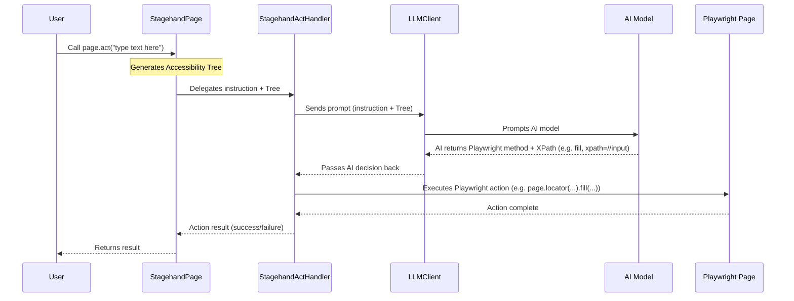

# Chapter 5: AI Action Handlers

Welcome back to the Stagehand tutorial! In the [previous chapter: Web Content Representation (Accessibility Tree)](04_web_content_representation__accessibility_tree__.md), we learned how Stagehand's AI "sees" a web page by transforming its complex structure into a simplified, meaningful "Accessibility Tree." The AI can now understand what's on the page.

But understanding isn't enough. How does Stagehand actually *do* things on the page, like clicking a button or typing text, once the AI has made a decision?

## The Problem: Turning AI Decisions into Browser Actions

Imagine you've given a highly intelligent robot a map of a building (the Accessibility Tree) and a goal: "Go to the kitchen and make a sandwich." The robot, being smart, can analyze the map and decide: "First, I will walk down the hallway. Then, I will open the kitchen door. Then, I will find the fridge..."

The robot knows *what* to do and *where* to do it. But how does it actually *walk*? How does it *open* a door? It needs specific physical "mechanisms" or "limbs" that perform these actions.

In Stagehand, it's similar. The AI receives your high-level instruction, understands the page's layout (thanks to the Accessibility Tree), and then decides *what Playwright action* to perform and on *which specific element* (identified by its XPath). For example, the AI might decide: "Okay, to fulfill 'type into search bar', I need to use the `fill` action on the element at XPath `/html/body/div[1]/form/input`."

How does Stagehand translate that AI decision into an actual `page.fill()` command in the browser?

## The Stagehand Solution: The Doers (AI Action Handlers)

This is where **AI Action Handlers** come in! These are the specialized "doers" or "operators" within Stagehand. They are like the robot's limbs and tools, capable of taking the AI's abstract decisions and executing them as concrete actions using the powerful browser automation library, Playwright.

Stagehand has three main types of AI Action Handlers, each corresponding to a core AI-driven action you can perform with `Stagehand Page`:

*   **`StagehandActHandler`**: This handler is responsible for taking AI's instructions (like "click the submit button") and performing actual browser actions like clicks, typing, or scrolling.
*   **`StagehandExtractHandler`**: This handler specializes in retrieving specific data from the page based on AI's understanding, often returning it in a structured format.
*   **`StagehandObserveHandler`**: This handler helps the AI "look at" the page and identify elements, returning a list of potential actions or descriptions.

These handlers are the crucial link that bridges the gap between the AI's intelligence and the browser's physical interactions.

## How to Use AI Action Handlers (Indirectly)

As a Stagehand user, you won't directly create or call these handlers. Instead, you interact with them *indirectly* through the AI-powered methods on your `stagehand.page` object, which we learned about in [Chapter 3: Stagehand Page](03_stagehand_page_.md).

Let's revisit our search example:

```typescript
import { Stagehand } from "@browserbasehq/stagehand";

async function automateSearch() {
  const stagehand = new Stagehand({
    env: "LOCAL",
    modelName: "gpt-4o",
    headless: false,
    verbose: 1,
  });
  await stagehand.init();

  await stagehand.page.goto("https://www.google.com");

  // 1. "act" instruction
  console.log("Asking Stagehand to type and search...");
  await stagehand.page.act("type 'Stagehand project' into the search bar and press enter");
  console.log("Search action delegated to StagehandActHandler!");

  // 2. "extract" instruction
  console.log("Asking Stagehand to extract heading...");
  const resultHeading = await stagehand.page.extract(
    "What is the main heading on this page?"
  );
  console.log("Extraction action delegated to StagehandExtractHandler!");
  console.log("Main heading:", resultHeading.extraction);

  // 3. "observe" instruction
  console.log("Asking Stagehand to observe links...");
  const observations = await stagehand.page.observe(
    "find all clickable links on the page"
  );
  console.log("Observation action delegated to StagehandObserveHandler!");
  console.log("Found first link:", observations[0]?.description);

  await stagehand.close();
}

automateSearch();
```

When you call `stagehand.page.act()`, `extract()`, or `observe()`, the `Stagehand Page` object internally decides which specific **AI Action Handler** to call to fulfill your request.

## Under the Hood: How Handlers Work Their Magic

Let's peek behind the curtain to understand how these handlers operate.

### Non-Code Walkthrough: The Chain of Execution

Consider the `page.act("type 'Stagehand project' into the search bar")` call:

1.  **You give an instruction**: You call `stagehand.page.act("...")`.
2.  **StagehandPage receives the request**: The `Stagehand Page` object (your smart browser tab) gets your high-level instruction.
3.  **Prepare the page context**: The `Stagehand Page` generates the detailed [Accessibility Tree](04_web_content_representation__accessibility_tree__.md) of the current page. This tree is a simplified, AI-friendly representation of all interactive elements and their XPaths.
4.  **Delegate to the handler**: The `Stagehand Page` then passes your instruction, along with the Accessibility Tree, to the `StagehandActHandler`.
5.  **Handler consults the AI**: The `StagehandActHandler` takes your instruction and the Accessibility Tree and constructs a special prompt for the AI. It then sends this prompt to the [LLMClient](01_llm_client___provider_.md) (which talks to the actual AI model).
6.  **AI makes a concrete decision**: The AI processes the prompt and the Accessibility Tree. It decides on the *most appropriate Playwright method* to use (e.g., `fill`, `click`, `press`) and the *exact XPath* of the element where that action should occur (e.g., `fill` on `xpath=//input[@name='q']`). It sends this decision back to the `StagehandActHandler`.
7.  **Handler performs the action**: The `StagehandActHandler` receives the AI's decision. It then uses Playwright's capabilities to find the element using the provided XPath and execute the specified method (e.g., `page.locator('xpath=//input[@name="q"]').fill('Stagehand project')`).
8.  **Report result**: The handler then reports whether the action was successful back to the `Stagehand Page`, which in turn, returns the result to you.

This same general flow applies to `extract` (where the AI returns data based on your query) and `observe` (where the AI returns a list of elements it found).

Here's a simplified flow for the `act` process:



### Code Deep Dive: Inside the Handlers

Let's look at simplified snippets from the handler files to see how this works.

#### 1. `StagehandActHandler` (`lib/handlers/actHandler.ts`)

This handler orchestrates actions. Its `observeAct` method combines observing the page and then acting on the result, and `_performPlaywrightMethod` is where the actual Playwright command is executed.

```typescript
// lib/handlers/actHandler.ts (simplified constructor)
export class StagehandActHandler {
  private readonly stagehandPage: StagehandPage;
  private readonly logger: (logLine: LogLine) => void;

  constructor({
    logger,
    stagehandPage,
  }: {
    logger: (logLine: LogLine) => void;
    stagehandPage: StagehandPage;
  }) {
    this.logger = logger;
    this.stagehandPage = stagehandPage;
  }

  // ... other methods like observeAct and actFromObserveResult ...
}
```
The constructor simply sets up internal references to the `StagehandPage` and logger.

The `observeAct` method first calls the `StagehandObserveHandler` (which we'll see next) to get a list of elements and suggested actions, then uses `actFromObserveResult` to execute the first suggestion.

```typescript
// lib/handlers/actHandler.ts (simplified observeAct method)
public async observeAct(
  actionOrOptions: ActOptions,
  observeHandler: StagehandObserveHandler, // Stagehand's observe handler
  llmClient: LLMClient, // Our AI communication client
  requestId: string,
): Promise<ActResult> {
  // 1. Build prompt for AI, asking it to suggest an action
  const instruction = buildActObservePrompt(action, /* ... */);

  // 2. Use the observe handler to get AI's suggested actions/elements
  const observeResults = await observeHandler.observe({
    instruction,
    llmClient,
    requestId,
    returnAction: true, // Ask AI to return action suggestions
    // ...
  });

  // 3. If AI suggests an action, execute it via actFromObserveResult
  if (observeResults.length > 0) {
    const element = observeResults[0];
    return this.actFromObserveResult(element, /* ... */);
  } else {
    return { success: false, message: "No action found." };
  }
}
```

The `_performPlaywrightMethod` is the core function that executes the Playwright command based on what the AI decided.

```typescript
// lib/handlers/actHandler.ts (simplified _performPlaywrightMethod)
import { deepLocator, methodHandlerMap } from "./handlerUtils/actHandlerUtils";

private async _performPlaywrightMethod(
  method: string, // e.g., "fill", "click"
  args: unknown[], // e.g., ["Stagehand project"]
  rawXPath: string, // e.g., "//input[@name='q']"
) {
  const xpath = rawXPath.replace(/^xpath=/i, "").trim();
  // 1. Get Playwright's Locator for the element using the XPath
  const locator = deepLocator(this.stagehandPage.page, xpath).first();

  // 2. Context for the action
  const context = { method, locator, xpath, args, /* ... */ };

  try {
    // 3. Look up the specific Playwright function in our map (e.g., 'fill')
    const methodFn = methodHandlerMap[method];
    if (methodFn) {
      await methodFn(context); // Call the actual Playwright function!
    } else {
      // Fallback if not in map, but still a valid Playwright method
      await fallbackLocatorMethod(context);
    }
    // Always wait for the page to settle after an action
    await this.stagehandPage._waitForSettledDom();
  } catch (e) {
    throw new PlaywrightCommandException(e.message);
  }
}
```
`methodHandlerMap` (from `lib/handlers/handlerUtils/actHandlerUtils.ts`) is a crucial part. It directly maps AI's chosen method names (like `"fill"`, `"click"`) to specific helper functions that wrap Playwright calls. For example, `fillOrType` is the function that handles both "fill" and "type" actions.

```typescript
// lib/handlers/handlerUtils/actHandlerUtils.ts (simplified)
export const methodHandlerMap: Record<
  string,
  (ctx: MethodHandlerContext) => Promise<void>
> = {
  scrollIntoView: scrollElementIntoView,
  fill: fillOrType, // The AI might pick 'fill' or 'type'
  type: fillOrType,
  click: clickElement, // The AI might pick 'click'
  press: pressKey,
  // ... many more mappings for other actions
};

export async function fillOrType(ctx: MethodHandlerContext) {
  const { locator, args } = ctx;
  const text = args[0]?.toString() || "";
  await locator.fill(text, { force: true }); // Playwright's fill method
}

export async function clickElement(ctx: MethodHandlerContext) {
  const { locator } = ctx;
  await locator.click({ timeout: 3_500 }); // Playwright's click method
}
```
This demonstrates how a high-level `act` instruction (`type 'Stagehand project'`) is broken down by AI, and then executed by the handler calling specific Playwright functions (`locator.fill`).

#### 2. `StagehandExtractHandler` (`lib/handlers/extractHandler.ts`)

This handler manages data extraction. It takes your instruction and schema, gets the Accessibility Tree, asks the LLM, and processes the structured output.

```typescript
// lib/handlers/extractHandler.ts (simplified constructor)
export class StagehandExtractHandler {
  private readonly stagehandPage: StagehandPage;
  private readonly logger: (logLine: LogLine) => void;

  constructor({
    logger,
    stagehandPage,
  }: {
    logger: (message: LogLine) => void;
    stagehandPage: StagehandPage;
  }) {
    this.logger = logger;
    this.stagehandPage = stagehandPage;
  }

  // ... other methods like extract and domExtract ...
}
```

Its `domExtract` method is the core for AI-driven data extraction:

```typescript
// lib/handlers/extractHandler.ts (simplified domExtract method)
import { extract as extractInference } from "../inference"; // The core AI inference call
import { getAccessibilityTree } from "@/lib/a11y/utils"; // Our tree builder

private async domExtract<T extends z.AnyZodObject>({
  instruction, // "What is the main heading?"
  schema,      // Zod schema for structured output
  llmClient,   // LLM client for AI communication
}: { /* ... */ }): Promise<z.infer<T>> {
  await this.stagehandPage._waitForSettledDom();

  // 1. Get the Accessibility Tree
  const { simplified: outputString } = await getAccessibilityTree(
    this.stagehandPage,
    this.logger,
  );

  // 2. Call the AI inference function
  const extractionResponse = await extractInference({
    instruction,
    domElements: outputString, // Send the tree to AI
    schema,
    llmClient,
    // ...
  });

  // 3. Process the AI's structured response
  const { data: extractedData } = extractionResponse as LLMParsedResponse<T>;
  return extractedData;
}
```
Here, `extractInference` (from `lib/inference.ts`) is the actual function that constructs the prompt for the LLM, including the accessibility tree and the desired schema, and then sends it to the `LLMClient`.

#### 3. `StagehandObserveHandler` (`lib/handlers/observeHandler.ts`)

This handler is responsible for understanding the page and suggesting elements or actions.

```typescript
// lib/handlers/observeHandler.ts (simplified constructor)
export class StagehandObserveHandler {
  private readonly stagehandPage: StagehandPage;
  private readonly logger: (logLine: LogLine) => void;

  constructor({
    logger,
    stagehandPage,
  }: {
    logger: (logLine: LogLine) => void;
    stagehandPage: StagehandPage;
  }) {
    this.logger = logger;
    this.stagehandPage = stagehandPage;
  }
}
```

Its `observe` method fetches the tree, sends to the LLM, and formats the AI's response:

```typescript
// lib/handlers/observeHandler.ts (simplified observe method)
import { observe as observeInference } from "../inference"; // Core AI inference call

public async observe({
  instruction, // "Find all clickable links"
  llmClient,   // LLM client for AI communication
}: { /* ... */ }) {
  await this.stagehandPage._waitForSettledDom();

  // 1. Get the Accessibility Tree
  const { combinedTree, combinedXpathMap } = await getAccessibilityTreeWithFrames(
    this.stagehandPage,
    this.logger,
  );

  // 2. Call the AI inference function
  const observationResponse = await observeInference({
    instruction,
    domElements: combinedTree, // Send the tree to AI
    llmClient,
    // ...
  });

  // 3. Map AI's element IDs back to XPaths and format results
  const elementsWithSelectors = await Promise.all(
    observationResponse.elements.map(async (element) => {
      const xpath: string | undefined = combinedXpathMap[element.elementId];
      if (xpath) {
        return {
          ...element,
          selector: `xpath=${xpath}`, // Attach the XPath
        };
      }
      return undefined;
    })
  );
  return elementsWithSelectors.filter(Boolean);
}
```
Here, `observeInference` (from `lib/inference.ts`) is the function that prepares the prompt for the LLM, asking it to identify relevant elements and their potential actions based on the instruction and the accessibility tree.

These handlers are the workhorses of Stagehand, translating high-level AI concepts into low-level browser commands, making complex automation tasks feel simple.

## Summary

| Concept                  | Analogy                     | Role in Stagehand                                                 | Key Responsibility                               |
| :----------------------- | :-------------------------- | :---------------------------------------------------------------- | :----------------------------------------------- |
| **AI Action Handlers**   | The Robot's Limbs & Tools   | Execute AI decisions as concrete browser actions.                 | Bridging AI logic with Playwright execution.     |
| `StagehandActHandler`    | The Doer (Clicker, Typer)   | Performs actions like clicks, fills, presses based on AI's choice.| Executing browser interactions.                  |
| `StagehandExtractHandler`| The Data Gatherer           | Extracts specific, structured data from the page using AI.        | Retrieving information from the web.             |
| `StagehandObserveHandler`| The Page Analyst            | Helps AI identify and describe elements and their potential uses. | Understanding and structuring page elements.     |

You've now seen how Stagehand takes your high-level instructions, understands the page, consults an AI, and then uses specialized "handlers" to execute the precise actions in the browser.

In the next chapter, we'll bring all these pieces together and explore how Stagehand uses an "Agentic Workflow" to string together multiple AI decisions and actions to achieve complex, multi-step automation goals.

[Next Chapter: Agentic Workflow (Agent & Operator)](06_agentic_workflow__agent___operator__.md)

---

<sub><sup>Generated by [AI Codebase Knowledge Builder](https://github.com/The-Pocket/Tutorial-Codebase-Knowledge).</sup></sub> <sub><sup>**References**: [[1]](https://github.com/browserbase/stagehand/blob/8de7bd8635c2051cd8025e365c6c8aa83d81c7e7/lib/handlers/actHandler.ts), [[2]](https://github.com/browserbase/stagehand/blob/8de7bd8635c2051cd8025e365c6c8aa83d81c7e7/lib/handlers/extractHandler.ts), [[3]](https://github.com/browserbase/stagehand/blob/8de7bd8635c2051cd8025e365c6c8aa83d81c7e7/lib/handlers/handlerUtils/actHandlerUtils.ts), [[4]](https://github.com/browserbase/stagehand/blob/8de7bd8635c2051cd8025e365c6c8aa83d81c7e7/lib/handlers/observeHandler.ts), [[5]](https://github.com/browserbase/stagehand/blob/8de7bd8635c2051cd8025e365c6c8aa83d81c7e7/lib/inference.ts), [[6]](https://github.com/browserbase/stagehand/blob/8de7bd8635c2051cd8025e365c6c8aa83d81c7e7/types/act.ts)</sup></sub>