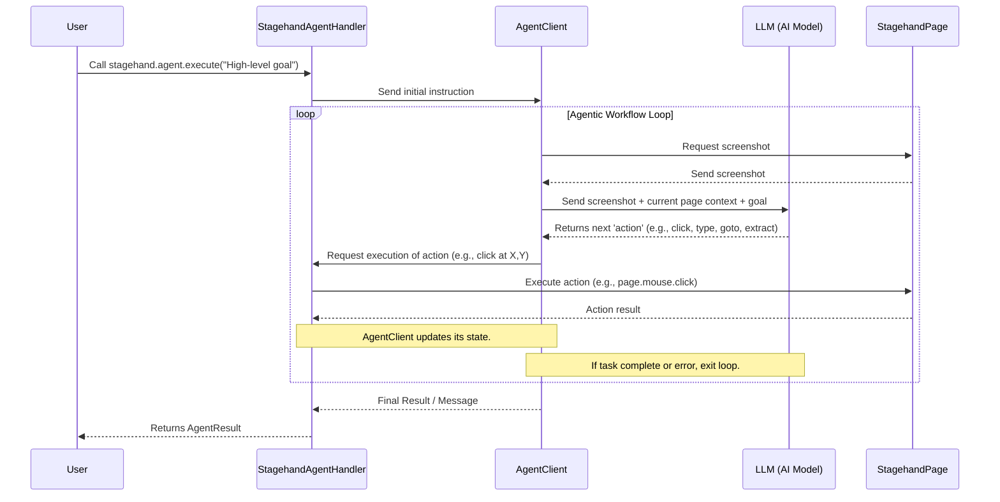

# Chapter 6: Agentic Workflow (Agent & Operator)


Welcome back! In the [previous chapter: AI Action Handlers](05_ai_action_handlers_.md), we explored how Stagehand's AI Action Handlers (`StagehandActHandler`, `StagehandExtractHandler`, `StagehandObserveHandler`) translate AI decisions into precise browser commands like clicks and text input.

These handlers are great for performing single, specific actions on a web page. But what if your goal is more complex?

## The Problem: Achieving Complex, Multi-Step Goals

Imagine you want to find the current population of Paris on Wikipedia. This isn't a single action. It involves a sequence of steps:

1.  Go to Wikipedia's website.
2.  Find the search bar.
3.  Type "Paris population" into the search bar.
4.  Click the search button (or press Enter).
5.  Locate the population figure on the results page.
6.  Extract that specific number.

Doing this with just `page.act()` or `page.goto()` calls means you'd have to write each step yourself, manually deciding what to do next based on what you see. This is like telling a robot every single micro-movement: "lift foot, move forward 2 inches, place foot down..." It works, but it's tedious and not very smart.

We need an abstraction that allows us to give Stagehand a single, high-level instruction, and let it figure out the entire sequence of steps.

## The Stagehand Solution: Agentic Workflow (Agent & Operator)

This is where the **Agentic Workflow** comes in! It's Stagehand's way of empowering the AI to perform complex, multi-step browser automation tasks from a single high-level instruction.

Think of it like this:

*   **You (the User)**: You give a single, overarching goal: "Find the population of Paris on Wikipedia."
*   **The Agent**: Stagehand uses a `StagehandAgent` (or a specific type called an `Operator`) as a **"smart robot"** that takes your goal, then *reasons*, *plans*, and *executes* a sequence of `act`, `extract`, or `goto` steps to achieve that larger goal autonomously. It continuously observes the page, decides the next best action, performs it, and repeats until the goal is met or it gets stuck.

### Key Concepts:

1.  **`StagehandAgent`**: This is the core interface for interacting with any type of AI agent in Stagehand. When you call `stagehand.agent.execute()`, you're using this. It's designed to abstract away the complexity of managing an autonomous AI, letting you focus on the goal.
2.  **`AgentClient`**: (Under the hood) Stagehand uses different `AgentClient` implementations to connect to various AI agents. This could be an **external agent** provided by an LLM company (like OpenAI's "Computer Use Agent" or Anthropic's "Tool Use" capabilities for web browsing), or it could be Stagehand's **own internal agent** logic.
3.  **`Operator`**: This is Stagehand's *own special type of agent*. It's designed specifically for autonomous web navigation and data gathering. When you use the `Operator`, Stagehand uses a general-purpose LLM (like `gpt-4o`) and continually feeds it screenshots and instructions, asking it to decide the next `act`, `extract`, or `goto` step. This loop continues until the task is marked complete.

The beauty of this is that you, as the user, often just say `stagehand.agent.execute("your high-level goal")`, and Stagehand handles whether it's using an external agent or its own `Operator` to get the job done.

## How to Use the Agentic Workflow

Using the Agentic Workflow is incredibly simple. Once you've initialized your `Stagehand` orchestrator (as learned in [Chapter 2: Stagehand Orchestrator](02_stagehand_orchestrator_.md)), you access the agent through `stagehand.agent`.

Let's use our example: "Find the population of Paris on Wikipedia."

```typescript
import { Stagehand } from "@browserbasehq/stagehand";

async function findParisPopulation() {
  const stagehand = new Stagehand({
    env: "LOCAL", // Run browser locally
    modelName: "gpt-4o", // Or a specific agent model like "computer-use-preview"
    headless: false, // Show the browser
    verbose: 1, // Log detailed steps
    // To use Stagehand's internal "Operator" agent, you enable it like this:
    // agent: { agentType: "operator", modelName: "gpt-4o" },
    // If you don't specify `agentType: "operator"`, Stagehand might try to use
    // an external agent if your `modelName` (e.g., "computer-use-preview") supports it.
  });

  // 1. Initialize Stagehand and get the browser ready
  await stagehand.init();
  console.log("Stagehand is ready to run an agentic workflow!");

  // 2. Give the high-level instruction to the agent
  console.log("Asking the agent to find the population of Paris on Wikipedia...");
  const result = await stagehand.agent.execute(
    "Find the current population of Paris, France on Wikipedia. " +
    "Once found, state the population clearly as the final answer."
  );

  // 3. The agent returns the final result
  if (result.success) {
    console.log("Agent completed the task!");
    console.log("Final Answer:", result.message);
    // Expected output: "Final Answer: The population of Paris, France is approximately 2,102,650 (as of 2021)." (or similar)
  } else {
    console.error("Agent failed to complete the task:", result.message);
  }

  // Don't forget to close when done!
  await stagehand.close();
  console.log("Automation finished and browser closed.");
}

findParisPopulation();
```

**Expected behavior:** A browser window will open, navigate to Wikipedia, search for "Paris population," find the relevant information, and print the population figure to your console. All of these steps are autonomously handled by the agent based on your single high-level instruction!

Notice how simple your code is: one call to `stagehand.agent.execute()`. This call triggers a complex series of decisions and actions by the AI behind the scenes.

## Under the Hood: The Agent's Iterative Loop

How does the agent magically break down a complex task into individual steps? It uses an iterative, "observe-decide-act" loop:

1.  **Observe**: The agent captures a screenshot of the current page and gathers context (like the current URL).
2.  **Decide**: It sends this visual and textual context, along with your original instruction, to a powerful Large Language Model (LLM). The LLM analyzes the page and your goal, then decides the *next best single action* to take (e.g., "go to this URL," "click this button," "type this text," "extract this data").
3.  **Act**: Stagehand executes the chosen action on the browser using its underlying Playwright capabilities (and the [AI Action Handlers](05_ai_action_handlers_.md) we learned about in the previous chapter).
4.  **Repeat**: The loop then starts again with a new observation of the updated page, and the agent decides the next step, continuously moving towards the overall goal. This continues until the LLM decides the task is complete.

Here's a simplified flow for an agentic workflow:



### Code Deep Dive: Orchestrating the Agent

Let's look at simplified snippets from the relevant files.

#### 1. `StagehandAgent` (`lib/agent/StagehandAgent.ts`)

This is the class that `stagehand.agent` points to. Its `execute` method is your entry point.

```typescript
// lib/agent/StagehandAgent.ts (simplified)
import { AgentClient } from "./AgentClient"; // Our underlying agent client

export class StagehandAgent {
  private client: AgentClient; // The specific agent client (e.g., OpenAI CUA client)
  private logger: (message: any) => void;

  constructor(client: AgentClient, logger: (message: any) => void) {
    this.client = client;
    this.logger = logger;
  }

  async execute(optionsOrInstruction: string): Promise<any> {
    const options = typeof optionsOrInstruction === "string" ? { instruction: optionsOrInstruction } : optionsOrInstruction;
    this.logger({ category: "agent", message: `Executing agent task: ${options.instruction}` });

    // The actual heavy lifting is delegated to the specific AgentClient
    return await this.client.execute({ options, logger: this.logger });
  }

  // ... other getter methods ...
}
```
The `StagehandAgent` is a thin wrapper that delegates the actual execution to an `AgentClient`.

#### 2. `AgentClient` and `AgentProvider` (`lib/agent/AgentClient.ts`, `lib/agent/AgentProvider.ts`)

`AgentClient` is the abstract blueprint for different types of agents (like `OpenAICUAClient` for OpenAI's Computer Use Agent or `AnthropicCUAClient` for Anthropic's agent). The `AgentProvider` acts as a factory, giving you the correct `AgentClient` based on the chosen model. This is similar to the [LLMProvider](01_llm_client___provider_.md) from Chapter 1.

```typescript
// lib/agent/AgentClient.ts (simplified)
export abstract class AgentClient {
  public type: string; // e.g., "openai", "anthropic"
  public modelName: string;

  constructor(type: string, modelName: string) {
    this.type = type;
    this.modelName = modelName;
  }

  // The core method that all agent clients must implement
  abstract execute(options: any): Promise<any>;

  // Methods to set up callbacks for the agent to interact with Stagehand
  abstract captureScreenshot(options?: any): Promise<any>;
  abstract setActionHandler(handler: (action: any) => Promise<void>): void;
  // ... other methods like setViewport, setCurrentUrl ...
}

// lib/agent/AgentProvider.ts (simplified)
import { OpenAICUAClient } from "./OpenAICUAClient"; // Specific OpenAI Agent client
import { AnthropicCUAClient } from "./AnthropicCUAClient"; // Specific Anthropic Agent client

const modelToAgentProviderMap: Record<string, string> = {
  "computer-use-preview": "openai", // OpenAI's agent model
  "claude-3-7-sonnet-latest": "anthropic", // Anthropic's agent model
  // ... other mappings
};

export class AgentProvider {
  // ... constructor ...

  getClient(modelName: string): AgentClient {
    const type = modelToAgentProviderMap[modelName];
    switch (type) {
      case "openai":
        return new OpenAICUAClient(type, modelName);
      case "anthropic":
        return new AnthropicCUAClient(type, modelName);
      // Stagehand's own 'Operator' agent is handled differently (see OperatorHandler)
      default:
        throw new Error(`Unsupported agent model: ${modelName}`);
    }
  }
}
```
The `AgentClient` defines the common actions an agent can take (like `execute`). The `AgentProvider` knows which specific client to create for the chosen AI model.

#### 3. `StagehandAgentHandler` (`lib/handlers/agentHandler.ts`)

This class is the glue. It lives within Stagehand's internal structure and initializes the `AgentClient` and `StagehandAgent`. Crucially, it sets up callbacks that allow the `AgentClient` (which represents the AI agent's logic) to request browser actions *back* from Stagehand.

```typescript
// lib/handlers/agentHandler.ts (simplified)
import { StagehandPage } from "../StagehandPage";
import { AgentProvider } from "../agent/AgentProvider";
import { StagehandAgent } from "../agent/StagehandAgent";

export class StagehandAgentHandler {
  private stagehandPage: StagehandPage;
  private agent: StagehandAgent;
  private agentClient: AgentClient; // The actual client instance

  constructor(stagehand: any, stagehandPage: StagehandPage, logger: any, options: any) {
    this.stagehandPage = stagehandPage;
    // 1. Get the right AgentClient from the provider
    this.provider = new AgentProvider(logger);
    this.agentClient = this.provider.getClient(options.modelName, /* ... */);

    // 2. Set up callbacks for the agent client to "talk back" to Stagehand
    this.setupAgentClient();

    // 3. Create the StagehandAgent wrapper
    this.agent = new StagehandAgent(this.agentClient, logger);
  }

  // This method sets up the communication channels
  private setupAgentClient(): void {
    // When the agent needs a screenshot, this function is called
    this.agentClient.setScreenshotProvider(async () => {
      const screenshot = await this.stagehandPage.page.screenshot({ fullPage: false });
      return screenshot.toString("base64"); // Base64 image
    });

    // When the agent decides on an action, this function is called
    this.agentClient.setActionHandler(async (action) => {
      // This is where the agent's decision (e.g., click at X,Y) is executed
      await this.executeAction(action);
      // After each action, take another screenshot for the next AI decision
      await this.captureAndSendScreenshot();
    });

    // ... set up viewport and URL updates for the agent ...
  }

  // This method executes the specific Playwright action decided by the agent
  private async executeAction(action: any): Promise<any> {
    switch (action.type) {
      case "click":
        await this.stagehandPage.page.mouse.click(action.x, action.y);
        break;
      case "type":
        await this.stagehandPage.page.keyboard.type(action.text);
        break;
      case "function": // For goto, back, etc.
        if (action.name === "goto") {
          await this.stagehandPage.page.goto(action.arguments.url);
        }
        // ... other function calls ...
        break;
      case "key": // For pressing specific keys like Enter, Tab
        if (action.text === "Enter") {
          await this.stagehandPage.page.keyboard.press("Enter");
        }
        break;
      // ... more action types ...
      default:
        throw new Error(`Unsupported agent action type: ${action.type}`);
    }
  }

  // The public execute method for stagehand.agent.execute(...)
  async execute(optionsOrInstruction: string): Promise<any> {
    // ... logic to prepare initial screenshot if needed ...
    return await this.agent.execute(optionsOrInstruction);
  }
}
```
The `StagehandAgentHandler` is crucial because it sets up the `setScreenshotProvider` (so the agent can *see* the page) and `setActionHandler` (so the agent can *do* things on the page). When the underlying `AgentClient` (the actual AI agent logic) decides on an action, it calls this `setActionHandler`, which then translates the action (like "click at X,Y") into a Playwright command.

#### 4. `OperatorHandler` (`lib/handlers/operatorHandler.ts`)

The `OperatorHandler` is Stagehand's *own implementation* of an agent. It uses a generic LLM (not an agent-specific one like OpenAI CUA) to drive the browser. It implements the "observe-decide-act" loop itself.

```typescript
// lib/handlers/operatorHandler.ts (simplified)
import { LLMClient } from "../llm/LLMClient"; // Our generic LLM client
import { StagehandPage } from "../StagehandPage";
import { buildOperatorSystemPrompt } from "../prompt"; // To create AI prompts

export class StagehandOperatorHandler {
  private stagehandPage: StagehandPage;
  private llmClient: LLMClient; // The LLM client for communication
  private messages: any[]; // History of conversation with the LLM

  constructor(stagehandPage: StagehandPage, logger: any, llmClient: LLMClient) {
    this.stagehandPage = stagehandPage;
    this.logger = logger;
    this.llmClient = llmClient;
  }

  public async execute(instructionOrOptions: string): Promise<any> {
    const options = typeof instructionOrOptions === "string" ? { instruction: instructionOrOptions } : instructionOrOptions;
    this.messages = [buildOperatorSystemPrompt(options.instruction)]; // Start conversation
    let completed = false;
    let currentStep = 0;
    const maxSteps = options.maxSteps || 10;

    // This is the core agentic loop for the Operator
    while (!completed && currentStep < maxSteps) {
      const url = this.stagehandPage.page.url();
      const screenshot = await this.stagehandPage.page.screenshot({ fullPage: false });
      const base64Image = screenshot.toString("base64");

      // 1. Observe: Prepare the message to the LLM with screenshot and context
      this.messages.push({
        role: "user",
        content: [
          { type: "text", text: `Here is a screenshot of the current page (URL: ${url}):` },
          { type: "image_url", image_url: { url: `data:image/png;base64,${base64Image}` } },
        ],
      });

      // 2. Decide: Ask the LLM for the next step (action, parameters, reasoning)
      const nextStep = await this.getNextStep(currentStep); // Calls llmClient.createChatCompletion
      this.messages.push({ role: "assistant", content: JSON.stringify(nextStep) }); // Add AI's response to history

      // If the LLM says the task is complete, break the loop
      if (nextStep.method === "close") {
        completed = true;
      }

      // 3. Act: Execute the action suggested by the LLM
      await this.executeAction(nextStep);

      currentStep++;
    }

    return { success: true, message: await this.getSummary(options.instruction), completed };
  }

  // This internal method sends the current context to the LLM and gets its decision
  private async getNextStep(currentStep: number): Promise<any> {
    const { data: response } = await this.llmClient.createChatCompletion({
      options: {
        messages: this.messages,
        response_model: { name: "operatorResponseSchema", schema: { /* ... */ } }, // AI returns structured action
      },
      logger: this.logger,
    });
    return response;
  }

  // This internal method executes the action using StagehandPage's methods
  private async executeAction(action: any): Promise<unknown> {
    const { method, parameters } = action;
    const page = this.stagehandPage.page; // Our smart StagehandPage

    switch (method) {
      case "act":
        // Operator uses StagehandPage's AI-driven 'act'
        const [observeResult] = await page.observe(parameters);
        await page.act(observeResult);
        break;
      case "extract":
        // Operator uses StagehandPage's AI-driven 'extract'
        return await page.extract(parameters);
      case "goto":
        await page.goto(parameters);
        break;
      // ... other methods like wait, navback, refresh ...
      default:
        throw new Error(`Unknown action: ${method}`);
    }
  }
}
```
The `OperatorHandler` is a great example of Stagehand building its *own* agentic loop on top of its core components ([Stagehand Page](03_stagehand_page_.md), [LLM Client](01_llm_client___provider_.md)). It explicitly manages the conversation history with the LLM and the loop of taking screenshots, asking the LLM for the next step, and executing it.

## Summary

| Concept              | Analogy                        | Role in Stagehand                                                 | Key Responsibility                               |
| :------------------- | :----------------------------- | :---------------------------------------------------------------- | :----------------------------------------------- |
| **Agentic Workflow** | Autonomous Smart Robot         | Performing complex, multi-step browser tasks from a single goal. | Reasoning, planning, and executing sequences of actions. |
| `StagehandAgent`     | The User's Agent Interface     | The main class you interact with to run an agent.                 | Providing a simple `execute` method for complex tasks. |
| `AgentClient`        | Agent-Specific Translator      | Connects Stagehand to different types of AI agents (external or internal). | Handling communication details with a specific AI agent. |
| `Operator`           | Stagehand's Internal Web Agent | A specific `AgentClient` implementation that uses Stagehand's `act`/`extract`/`goto` methods. | Driving web automation through a continuous "observe-decide-act" loop using a general LLM. |

The Agentic Workflow is the pinnacle of Stagehand's capabilities, allowing you to delegate highly complex web tasks to an intelligent AI, freeing you from writing tedious step-by-step code.

Now that you've seen how Stagehand orchestrates powerful AI-driven browser automation, in the final chapter, we'll explore how to interact with Stagehand using its API client, enabling you to use Stagehand from various environments.

[Next Chapter: Stagehand API Client](07_stagehand_api_client_.md)

---

<sub><sup>Generated by [AI Codebase Knowledge Builder](https://github.com/The-Pocket/Tutorial-Codebase-Knowledge).</sup></sub> <sub><sup>**References**: [[1]](https://github.com/browserbase/stagehand/blob/8de7bd8635c2051cd8025e365c6c8aa83d81c7e7/lib/agent/AgentClient.ts), [[2]](https://github.com/browserbase/stagehand/blob/8de7bd8635c2051cd8025e365c6c8aa83d81c7e7/lib/agent/AgentProvider.ts), [[3]](https://github.com/browserbase/stagehand/blob/8de7bd8635c2051cd8025e365c6c8aa83d81c7e7/lib/agent/StagehandAgent.ts), [[4]](https://github.com/browserbase/stagehand/blob/8de7bd8635c2051cd8025e365c6c8aa83d81c7e7/lib/handlers/agentHandler.ts), [[5]](https://github.com/browserbase/stagehand/blob/8de7bd8635c2051cd8025e365c6c8aa83d81c7e7/lib/handlers/operatorHandler.ts), [[6]](https://github.com/browserbase/stagehand/blob/8de7bd8635c2051cd8025e365c6c8aa83d81c7e7/types/agent.ts), [[7]](https://github.com/browserbase/stagehand/blob/8de7bd8635c2051cd8025e365c6c8aa83d81c7e7/types/operator.ts)</sup></sub>