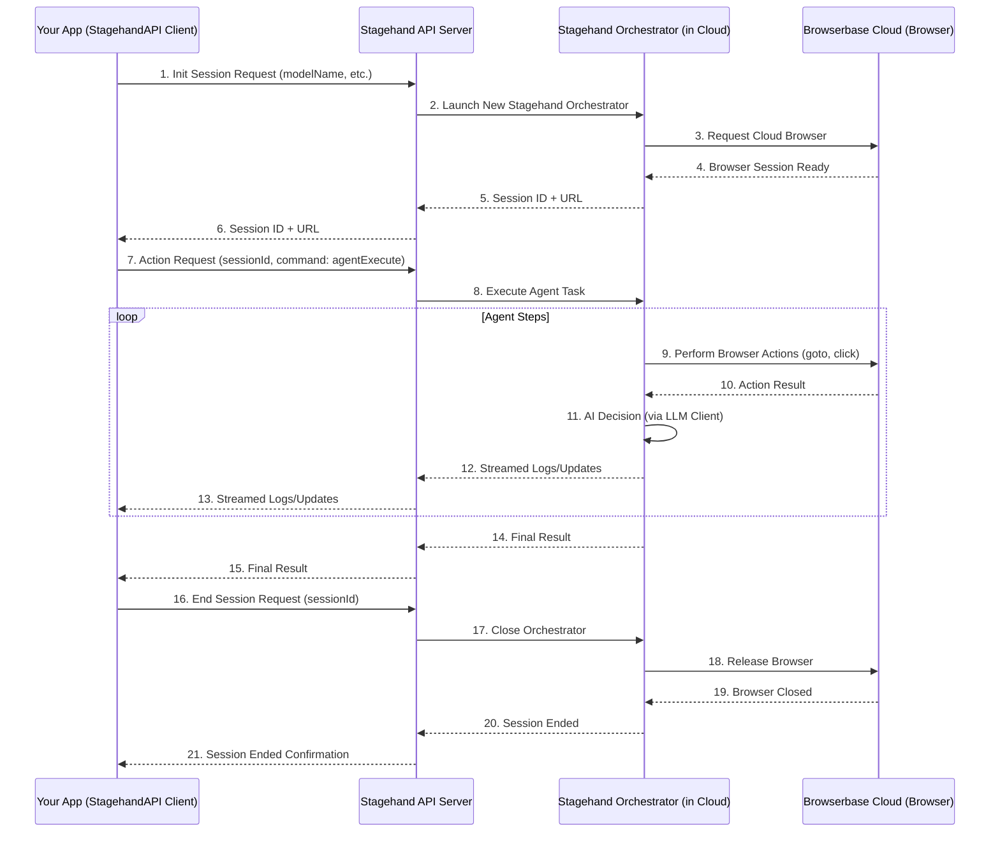

# Chapter 7: Stagehand API Client

Welcome to the final chapter of our Stagehand tutorial! In the [previous chapter: Agentic Workflow (Agent & Operator)](06_agentic_workflow__agent___operator__.md), we learned how Stagehand's intelligent agents can tackle complex, multi-step tasks all on their own. Throughout this tutorial, we've focused on using Stagehand by directly importing the `Stagehand` class and running it on your machine, or connecting directly to a cloud browser.

But what if you want to run your Stagehand automations from a different application, perhaps from a server-side backend, a mobile app, or as part of a larger system that doesn't have Node.js or Playwright installed? What if you need to run many automations at scale, centrally managed without worrying about local browser setups?

## The Problem: Running Stagehand Remotely and Scalably

Imagine you've built a powerful AI assistant that needs to gather information from websites. If this assistant is a web server or a cloud function, it's not ideal to have it directly launch web browsers or manage Playwright installations. This approach can be heavy, resource-intensive, and hard to scale. You might also want to control many browser sessions without setting up infrastructure for each.

The challenge is: How can you command Stagehand's browser automation capabilities from anywhere, without needing to install or manage complex browser environments yourself?

## The Stagehand Solution: Your Remote Control (`StagehandAPI`)

This is where the **`StagehandAPI` Client** comes in! Think of `StagehandAPI` as a **remote control** for Stagehand. Instead of running the entire Stagehand system (the `Stagehand` orchestrator, `Stagehand Page`, Playwright, etc.) directly on your computer, you use the `StagehandAPI` client to send commands over the internet to a central Stagehand service.

This service then runs the actual `Stagehand` orchestrator on a powerful, cloud-hosted browser (provided by Browserbase). It's like having a dedicated Stagehand machine in the cloud that you simply send instructions to, and it sends back the results.

This approach offers several benefits:

*   **No Local Browser Needed**: You don't need to install Chrome or Playwright on your machine.
*   **Scalability**: The cloud service handles launching and managing many browser sessions for you.
*   **Flexibility**: You can integrate Stagehand into almost any application or environment that can make HTTP requests.
*   **Centralized Management**: Browser sessions and their resources are managed by the Stagehand service.

Let's see how `StagehandAPI` allows us to "remotely control" Stagehand to solve our recurring problem: **"Find the current population of Paris on Wikipedia."**

## How to Use the Stagehand API Client

Using `StagehandAPI` is very similar to using the `Stagehand` class directly, but with a key difference: you import it from `@browserbasehq/stagehand/api`.

Here's how you'd use it to find the population of Paris:

```typescript
// Import the StagehandAPI client (notice the /api)
import { StagehandAPI } from "@browserbasehq/stagehand/api";

async function findParisPopulationRemotely() {
  // Make sure your API keys are set as environment variables
  // process.env.BROWSERBASE_API_KEY = "YOUR_BROWSERBASE_API_KEY";
  // process.env.BROWSERBASE_PROJECT_ID = "YOUR_BROWSERBASE_PROJECT_ID";
  // process.env.OPENAI_API_KEY = "YOUR_OPENAI_API_KEY"; // For the AI model

  // 1. Create a new StagehandAPI instance
  console.log("Creating StagehandAPI client...");
  const stagehandApi = new StagehandAPI({
    apiKey: process.env.BROWSERBASE_API_KEY!, // Your Browserbase API key
    projectId: process.env.BROWSERBASE_PROJECT_ID!, // Your Browserbase Project ID
    logger: (log) => console.log(`[Remote Log]: ${log.message}`),
  });

  // 2. Initialize a new remote Stagehand session
  // This tells the Stagehand service to launch a browser in the cloud.
  console.log("Initializing remote Stagehand session...");
  const initResult = await stagehandApi.init({
    modelName: "gpt-4o", // The AI model for the remote session
    modelApiKey: process.env.OPENAI_API_KEY!, // API key for the LLM
    verbose: 1, // Enable basic logs from the remote session
  });
  console.log("Remote session started with ID:", initResult.sessionId);
  console.log("You can view the session here:", initResult.sessionUrl);


  // 3. Command the remote agent to execute the task
  // This uses the agentic workflow (Chapter 6) on the remote session.
  console.log("Asking remote agent to find Paris population...");
  const result = await stagehandApi.agentExecute(
    { agentType: "operator", modelName: "gpt-4o" }, // Use Stagehand's built-in Operator agent
    {
      instruction: "Find the current population of Paris, France on Wikipedia. " +
                   "Once found, state the population clearly as the final answer.",
    },
  );

  // 4. Get the result from the remote session
  if (result.success) {
    console.log("Agent completed the task remotely!");
    console.log("Final Answer:", result.message);
  } else {
    console.error("Agent failed remotely:", result.message);
  }

  // 5. End the remote Stagehand session
  console.log("Ending remote Stagehand session...");
  await stagehandApi.end();
  console.log("Remote session ended.");
}

findParisPopulationRemotely();
```

**Expected behavior:**
Your console will show logs indicating the remote session starting, progress from the remote agent (streamed back to you), and finally the extracted population. No browser window will open on your local machine, as all the automation happens in the cloud!

Notice how the methods (`init`, `agentExecute`, `end`) are similar to the local `Stagehand` class, but they now communicate with a remote server instead of directly managing a local browser.

## Under the Hood: The Client-Server Connection

Let's peek behind the curtain to understand how `StagehandAPI` acts as a remote control.

### Non-Code Walkthrough: The Remote Interaction

1.  **You Create the Client**: You create an instance of `StagehandAPI` on your local machine (or server). This client has your API keys for authentication.
2.  **Request to Start Session (`init`)**: When you call `stagehandApi.init()`, your client sends an HTTP request over the internet to the central Stagehand API server. This request includes details like which AI model to use and any Browserbase session settings.
3.  **Server Launches Stagehand**: The Stagehand API server receives your request. It then *internally* launches its own instance of the `Stagehand` orchestrator (the one you learned about in [Chapter 2: Stagehand Orchestrator](02_stagehand_orchestrator_.md)). This orchestrator connects to a fresh, cloud-hosted browser provided by Browserbase. The server keeps track of a unique **Session ID** for this new browser session.
4.  **Session ID Returned**: The server sends back this `sessionId` to your `StagehandAPI` client. This ID is like a temporary "key" to control *your* specific remote browser session.
5.  **Sending Commands (`goto`, `act`, `agentExecute`, etc.)**: When you call methods like `stagehandApi.agentExecute()`, your `StagehandAPI` client again sends an HTTP request to the Stagehand API server. This time, the request includes the `sessionId` and the command (e.g., "run agent to find population").
6.  **Server Executes Command**: The Stagehand API server receives the command and uses the `sessionId` to find the correct running `Stagehand` orchestrator instance. It then tells *that specific orchestrator* to execute the command using its [Stagehand Page](03_stagehand_page_.md) or [Agentic Workflow](06_agentic_workflow__agent___operator_.md).
7.  **Results Stream Back**: As the remote Stagehand orchestrator performs the actions (navigating, typing, extracting), any logs or final results are streamed back from the Stagehand API server to your `StagehandAPI` client. This allows you to see progress in real-time.
8.  **Ending the Session (`end`)**: When you call `stagehandApi.end()`, your client sends a final request to the Stagehand API server. The server then closes down your specific remote `Stagehand` orchestrator instance and its associated cloud browser, freeing up resources.



### Code Deep Dive: Inside the `StagehandAPI` Class

Let's look at simplified versions of the `StagehandAPI` class (from `lib/api.ts`) to understand how it makes these remote calls.

#### `StagehandAPI` Constructor (Simplified)

```typescript
// lib/api.ts (simplified StagehandAPI constructor)
import makeFetchCookie from "fetch-cookie";
import { STAGEHAND_VERSION } from "./version";

export class StagehandAPI {
  private apiKey: string;
  private projectId: string;
  private sessionId?: string; // Stores the remote session ID
  private modelApiKey: string;
  private logger: (message: any) => void;
  private fetchWithCookies; // Helper for HTTP requests

  constructor({ apiKey, projectId, logger }: any) {
    this.apiKey = apiKey;
    this.projectId = projectId;
    this.logger = logger;
    this.fetchWithCookies = makeFetchCookie(fetch); // Uses 'fetch' to make requests
  }

  // ... other methods like init, act, extract, agentExecute, end ...
}
```
The constructor simply sets up the API keys and logger, and prepares a `fetch` function that can handle cookies (important for web sessions).

#### `StagehandAPI.init()` Method (Simplified)

```typescript
// lib/api.ts (simplified init method)
async init({ modelName, modelApiKey, browserbaseSessionID }: any): Promise<any> {
    if (!modelApiKey) {
      throw new Error("modelApiKey is required");
    }
    this.modelApiKey = modelApiKey;

    // This calls our internal 'request' method to send an HTTP POST to the server.
    const sessionResponse = await this.request("/sessions/start", {
      method: "POST",
      body: JSON.stringify({
        modelName,
        browserbaseSessionID,
        // ... other initialization parameters
      }),
    });

    // Handle HTTP errors or API errors
    if (!sessionResponse.ok) {
        throw new Error(`Failed to start session: ${sessionResponse.status}`);
    }

    const sessionResponseBody = await sessionResponse.json();
    if (!sessionResponseBody.success) {
      throw new Error(sessionResponseBody.message);
    }

    this.sessionId = sessionResponseBody.data.sessionId; // Store the received session ID
    return sessionResponseBody.data; // Returns sessionId, sessionUrl etc.
  }
```
The `init` method constructs a JSON payload with the desired session parameters (like `modelName`) and sends it as an HTTP POST request to the `/sessions/start` endpoint of the Stagehand API server. Crucially, it stores the `sessionId` returned by the server.

#### `StagehandAPI.agentExecute()` Method (Simplified)

```typescript
// lib/api.ts (simplified agentExecute method)
async agentExecute(agentConfig: any, executeOptions: any): Promise<any> {
    // This calls a generic 'execute' method which handles all remote commands.
    return this.execute<any>({
      method: "agentExecute", // The name of the command for the server
      args: { agentConfig, executeOptions }, // The arguments for the command
    });
  }
```
Like `agentExecute`, other methods like `act`, `extract`, `observe`, and `goto` also call a central `execute` method, providing a `method` name and `args` to pass to the remote server.

#### `StagehandAPI.execute()` Method (Simplified)

This is the core method that handles sending all commands and streaming responses.

```typescript
// lib/api.ts (simplified execute method)
private async execute<T>({ method, args }: { method: string; args: unknown }): Promise<T> {
    // Construct the URL for the command using the stored sessionId
    const url = `/sessions/${this.sessionId}/${method}`;

    // Send an HTTP POST request with the command details
    const response = await this.request(url, {
      method: "POST",
      body: JSON.stringify(args),
    });

    if (!response.ok) {
        const errorBody = await response.text();
        throw new Error(`HTTP error! status: ${response.status}, body: ${errorBody}`);
    }

    // Read the response body as a stream (for real-time logs)
    const reader = response.body.getReader();
    const decoder = new TextDecoder();
    let buffer = "";

    while (true) {
      const { value, done } = await reader.read();
      buffer += decoder.decode(value, { stream: true });
      const lines = buffer.split("\n\n"); // Split streamed events

      buffer = lines.pop() || ""; // Keep incomplete line in buffer

      for (const line of lines) {
        if (!line.startsWith("data: ")) continue; // Ignore non-data lines

        try {
          const eventData = JSON.parse(line.slice(6)); // Parse the event data
          if (eventData.type === "system" && eventData.data.status === "finished") {
            return eventData.data.result as T; // Return final result
          } else if (eventData.type === "log") {
            this.logger(eventData.data.message); // Log messages from remote
          }
        } catch (e) {
          console.error("Error parsing event data:", e);
        }
      }
      if (done) break; // End of stream
    }
    return null; // Should not reach here for successful commands
  }
```
The `execute` method is the workhorse. It builds the correct API endpoint using the `sessionId`, sends the `method` and `args` as a JSON payload, and then *streams* the response. This streaming allows your client to receive real-time logs and updates from the remote Stagehand session, making it feel like it's running locally.

The `request` helper function (not shown in detail here, but available in `lib/api.ts`) handles adding necessary authentication headers (`x-bb-api-key`, `x-bb-project-id`, `x-bb-session-id`, `x-model-api-key`) and sending the actual `fetch` call to the Stagehand API URL.

Through this client-server architecture, `StagehandAPI` provides a powerful and flexible way to leverage Stagehand's capabilities without managing local browser environments.

## Summary

| Concept              | Analogy                        | Role in Stagehand Ecosystem                                   | Key Responsibility                             |
| :------------------- | :----------------------------- | :------------------------------------------------------------ | :--------------------------------------------- |
| `StagehandAPI` Client| Remote Control                 | Sends commands over the network to a remote Stagehand server. | Initiating remote sessions, sending commands, receiving results. |
| Stagehand API Server | Cloud Automation Hub           | Receives commands, manages cloud browser sessions, runs Stagehand Orchestrator. | Hosting and executing Stagehand automations remotely. |
| Session ID           | Temporary Session Key          | A unique identifier linking your client to a specific remote browser session. | Maintaining state for a remote automation task. |

This concludes our journey through the core concepts of Stagehand! You've learned how Stagehand:

*   **Communicates with AI** ([LLM Client & Provider](01_llm_client___provider_.md))
*   **Orchestrates the entire automation** ([Stagehand Orchestrator](02_stagehand_orchestrator_.md))
*   **Interacts with web pages intelligently** ([Stagehand Page](03_stagehand_page_.md))
*   **Understands web content** ([Web Content Representation (Accessibility Tree)](04_web_content_representation__accessibility_tree__.md))
*   **Executes AI decisions as browser actions** ([AI Action Handlers](05_ai_action_handlers_.md))
*   **Tackles complex, multi-step goals** ([Agentic Workflow (Agent & Operator)](06_agentic_workflow__agent___operator__.md))
*   And finally, how you can **control all of this remotely and at scale** ([Stagehand API Client](07_stagehand_api_client_.md))

With this understanding, you're well-equipped to start building powerful, AI-driven web automations with Stagehand!

---

<sub><sup>Generated by [AI Codebase Knowledge Builder](https://github.com/The-Pocket/Tutorial-Codebase-Knowledge).</sup></sub> <sub><sup>**References**: [[1]](https://github.com/browserbase/stagehand/blob/8de7bd8635c2051cd8025e365c6c8aa83d81c7e7/lib/api.ts), [[2]](https://github.com/browserbase/stagehand/blob/8de7bd8635c2051cd8025e365c6c8aa83d81c7e7/types/api.ts), [[3]](https://github.com/browserbase/stagehand/blob/8de7bd8635c2051cd8025e365c6c8aa83d81c7e7/types/stagehandApiErrors.ts)</sup></sub>