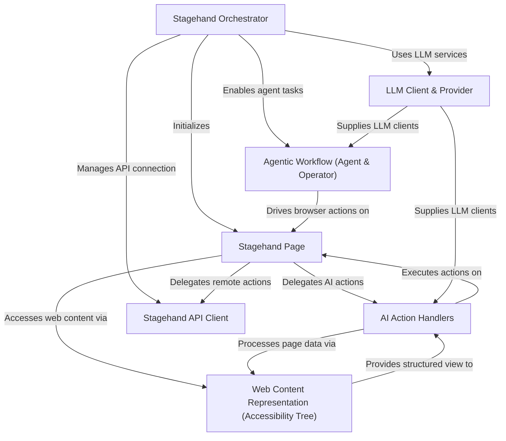

# Tutorial: stagehand

Stagehand is a powerful **AI-driven browser automation** framework that extends Playwright.
It allows users to command browsers using *natural language*, enabling complex tasks like
*understanding web page content*, *performing interactive actions*, and *extracting structured data*.
This can be done either on a local browser or seamlessly integrated with a *cloud-hosted browser*
via Browserbase, facilitating sophisticated agentic workflows.

## Visual Overview

## Chapters

1. [LLM Client & Provider
](01_llm_client___provider_.md)
2. [Stagehand Orchestrator
](02_stagehand_orchestrator_.md)
3. [Stagehand Page
](03_stagehand_page_.md)
4. [Web Content Representation (Accessibility Tree)
](04_web_content_representation__accessibility_tree__.md)
5. [AI Action Handlers
](05_ai_action_handlers_.md)
6. [Agentic Workflow (Agent & Operator)
](06_agentic_workflow__agent___operator__.md)
7. [Stagehand API Client
](07_stagehand_api_client_.md)

---

Generated by [AI Codebase Knowledge Builder](https://github.com/The-Pocket/Tutorial-Codebase-Knowledge).